# SMBMS项目

## 1.项目搭建

### 1.框架及数据库

- 整体框架图

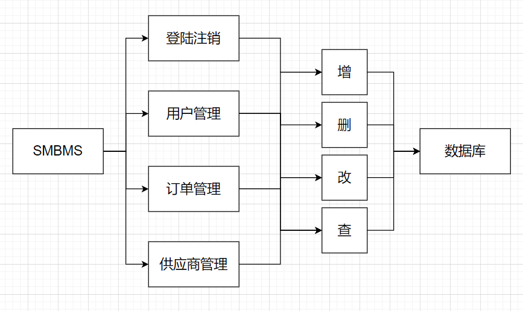

- MySQL数据库源码

```mysql
CREATE DATABASE `smbms`;

USE `smbms`;

DROP TABLE IF EXISTS `smbms_address`;

CREATE TABLE `smbms_address` (
  `id` BIGINT(20) NOT NULL AUTO_INCREMENT COMMENT '主键ID',
  `contact` VARCHAR(15) COLLATE utf8_unicode_ci DEFAULT NULL COMMENT '联系人姓名',
  `addressDesc` VARCHAR(50) COLLATE utf8_unicode_ci DEFAULT NULL COMMENT '收货地址明细',
  `postCode` VARCHAR(15) COLLATE utf8_unicode_ci DEFAULT NULL COMMENT '邮编',
  `tel` VARCHAR(20) COLLATE utf8_unicode_ci DEFAULT NULL COMMENT '联系人电话',
  `createdBy` BIGINT(20) DEFAULT NULL COMMENT '创建者',
  `creationDate` DATETIME DEFAULT NULL COMMENT '创建时间',
  `modifyBy` BIGINT(20) DEFAULT NULL COMMENT '修改者',
  `modifyDate` DATETIME DEFAULT NULL COMMENT '修改时间',
  `userId` BIGINT(20) DEFAULT NULL COMMENT '用户ID',
  PRIMARY KEY (`id`)
) ENGINE=INNODB AUTO_INCREMENT=7 DEFAULT CHARSET=utf8 COLLATE=utf8_unicode_ci;


INSERT  INTO `smbms_address`(`id`,`contact`,`addressDesc`,`postCode`,`tel`,`createdBy`,`creationDate`,`modifyBy`,`modifyDate`,`userId`) VALUES (1,'王丽','北京市东城区东交民巷44号','100010','13678789999',1,'2016-04-13 00:00:00',NULL,NULL,1),(2,'张红丽','北京市海淀区丹棱街3号','100000','18567672312',1,'2016-04-13 00:00:00',NULL,NULL,1),(3,'任志强','北京市东城区美术馆后街23号','100021','13387906742',1,'2016-04-13 00:00:00',NULL,NULL,1),(4,'曹颖','北京市朝阳区朝阳门南大街14号','100053','13568902323',1,'2016-04-13 00:00:00',NULL,NULL,2),(5,'李慧','北京市西城区三里河路南三巷3号','100032','18032356666',1,'2016-04-13 00:00:00',NULL,NULL,3),(6,'王国强','北京市顺义区高丽营镇金马工业区18号','100061','13787882222',1,'2016-04-13 00:00:00',NULL,NULL,3);


DROP TABLE IF EXISTS `smbms_bill`;

CREATE TABLE `smbms_bill` (
  `id` BIGINT(20) NOT NULL AUTO_INCREMENT COMMENT '主键ID',
  `billCode` VARCHAR(20) COLLATE utf8_unicode_ci DEFAULT NULL COMMENT '账单编码',
  `productName` VARCHAR(20) COLLATE utf8_unicode_ci DEFAULT NULL COMMENT '商品名称',
  `productDesc` VARCHAR(50) COLLATE utf8_unicode_ci DEFAULT NULL COMMENT '商品描述',
  `productUnit` VARCHAR(10) COLLATE utf8_unicode_ci DEFAULT NULL COMMENT '商品单位',
  `productCount` DECIMAL(20,2) DEFAULT NULL COMMENT '商品数量',
  `totalPrice` DECIMAL(20,2) DEFAULT NULL COMMENT '商品总额',
  `isPayment` INT(10) DEFAULT NULL COMMENT '是否支付（1：未支付 2：已支付）',
  `createdBy` BIGINT(20) DEFAULT NULL COMMENT '创建者（userId）',
  `creationDate` DATETIME DEFAULT NULL COMMENT '创建时间',
  `modifyBy` BIGINT(20) DEFAULT NULL COMMENT '更新者（userId）',
  `modifyDate` DATETIME DEFAULT NULL COMMENT '更新时间',
  `providerId` BIGINT(20) DEFAULT NULL COMMENT '供应商ID',
  PRIMARY KEY (`id`)
) ENGINE=INNODB AUTO_INCREMENT=19 DEFAULT CHARSET=utf8 COLLATE=utf8_unicode_ci;


INSERT  INTO `smbms_bill`(`id`,`billCode`,`productName`,`productDesc`,`productUnit`,`productCount`,`totalPrice`,`isPayment`,`createdBy`,`creationDate`,`modifyBy`,`modifyDate`,`providerId`) VALUES (2,'BILL2016_002','香皂、肥皂、药皂','日用品-皂类','块','1000.00','10000.00',2,1,'2016-03-23 04:20:40',NULL,NULL,13),(3,'BILL2016_003','大豆油','食品-食用油','斤','300.00','5890.00',2,1,'2014-12-14 13:02:03',NULL,NULL,6),(4,'BILL2016_004','橄榄油','食品-进口食用油','斤','200.00','9800.00',2,1,'2013-10-10 03:12:13',NULL,NULL,7),(5,'BILL2016_005','洗洁精','日用品-厨房清洁','瓶','500.00','7000.00',2,1,'2014-12-14 13:02:03',NULL,NULL,9),(6,'BILL2016_006','美国大杏仁','食品-坚果','袋','300.00','5000.00',2,1,'2016-04-14 06:08:09',NULL,NULL,4),(7,'BILL2016_007','沐浴液、精油','日用品-沐浴类','瓶','500.00','23000.00',1,1,'2016-07-22 10:10:22',NULL,NULL,14),(8,'BILL2016_008','不锈钢盘碗','日用品-厨房用具','个','600.00','6000.00',2,1,'2016-04-14 05:12:13',NULL,NULL,14),(9,'BILL2016_009','塑料杯','日用品-杯子','个','350.00','1750.00',2,1,'2016-02-04 11:40:20',NULL,NULL,14),(10,'BILL2016_010','豆瓣酱','食品-调料','瓶','200.00','2000.00',2,1,'2013-10-29 05:07:03',NULL,NULL,8),(11,'BILL2016_011','海之蓝','饮料-国酒','瓶','50.00','10000.00',1,1,'2016-04-14 16:16:00',NULL,NULL,1),(12,'BILL2016_012','芝华士','饮料-洋酒','瓶','20.00','6000.00',1,1,'2016-09-09 17:00:00',NULL,NULL,1),(13,'BILL2016_013','长城红葡萄酒','饮料-红酒','瓶','60.00','800.00',2,1,'2016-11-14 15:23:00',NULL,NULL,1),(14,'BILL2016_014','泰国香米','食品-大米','斤','400.00','5000.00',2,1,'2016-10-09 15:20:00',NULL,NULL,3),(15,'BILL2016_015','东北大米','食品-大米','斤','600.00','4000.00',2,1,'2016-11-14 14:00:00',NULL,NULL,3),(16,'BILL2016_016','可口可乐','饮料','瓶','2000.00','6000.00',2,1,'2012-03-27 13:03:01',NULL,NULL,2),(17,'BILL2016_017','脉动','饮料','瓶','1500.00','4500.00',2,1,'2016-05-10 12:00:00',NULL,NULL,2),(18,'BILL2016_018','哇哈哈','饮料','瓶','2000.00','4000.00',2,1,'2015-11-24 15:12:03',NULL,NULL,2);

DROP TABLE IF EXISTS `smbms_provider`;

CREATE TABLE `smbms_provider` (
  `id` BIGINT(20) NOT NULL AUTO_INCREMENT COMMENT '主键ID',
  `proCode` VARCHAR(20) COLLATE utf8_unicode_ci DEFAULT NULL COMMENT '供应商编码',
  `proName` VARCHAR(20) COLLATE utf8_unicode_ci DEFAULT NULL COMMENT '供应商名称',
  `proDesc` VARCHAR(50) COLLATE utf8_unicode_ci DEFAULT NULL COMMENT '供应商详细描述',
  `proContact` VARCHAR(20) COLLATE utf8_unicode_ci DEFAULT NULL COMMENT '供应商联系人',
  `proPhone` VARCHAR(20) COLLATE utf8_unicode_ci DEFAULT NULL COMMENT '联系电话',
  `proAddress` VARCHAR(50) COLLATE utf8_unicode_ci DEFAULT NULL COMMENT '地址',
  `proFax` VARCHAR(20) COLLATE utf8_unicode_ci DEFAULT NULL COMMENT '传真',
  `createdBy` BIGINT(20) DEFAULT NULL COMMENT '创建者（userId）',
  `creationDate` DATETIME DEFAULT NULL COMMENT '创建时间',
  `modifyDate` DATETIME DEFAULT NULL COMMENT '更新时间',
  `modifyBy` BIGINT(20) DEFAULT NULL COMMENT '更新者（userId）',
  PRIMARY KEY (`id`)
) ENGINE=INNODB AUTO_INCREMENT=16 DEFAULT CHARSET=utf8 COLLATE=utf8_unicode_ci;


INSERT  INTO `smbms_provider`(`id`,`proCode`,`proName`,`proDesc`,`proContact`,`proPhone`,`proAddress`,`proFax`,`createdBy`,`creationDate`,`modifyDate`,`modifyBy`) VALUES (1,'BJ_GYS001','北京三木堂商贸有限公司','长期合作伙伴，主营产品:茅台、五粮液、郎酒、酒鬼酒、泸州老窖、赖茅酒、法国红酒等','张国强','13566667777','北京市丰台区育芳园北路','010-58858787',1,'2013-03-21 16:52:07',NULL,NULL),(2,'HB_GYS001','石家庄帅益食品贸易有限公司','长期合作伙伴，主营产品:饮料、水饮料、植物蛋白饮料、休闲食品、果汁饮料、功能饮料等','王军','13309094212','河北省石家庄新华区','0311-67738876',1,'2016-04-13 04:20:40',NULL,NULL),(3,'GZ_GYS001','深圳市泰香米业有限公司','初次合作伙伴，主营产品：良记金轮米,龙轮香米等','郑程瀚','13402013312','广东省深圳市福田区深南大道6006华丰大厦','0755-67776212',1,'2014-03-21 16:56:07',NULL,NULL),(4,'GZ_GYS002','深圳市喜来客商贸有限公司','长期合作伙伴，主营产品：坚果炒货.果脯蜜饯.天然花茶.营养豆豆.特色美食.进口食品.海味零食.肉脯肉','林妮','18599897645','广东省深圳市福龙工业区B2栋3楼西','0755-67772341',1,'2013-03-22 16:52:07',NULL,NULL),(5,'JS_GYS001','兴化佳美调味品厂','长期合作伙伴，主营产品：天然香辛料、鸡精、复合调味料','徐国洋','13754444221','江苏省兴化市林湖工业区','0523-21299098',1,'2015-11-22 16:52:07',NULL,NULL),(6,'BJ_GYS002','北京纳福尔食用油有限公司','长期合作伙伴，主营产品：山茶油、大豆油、花生油、橄榄油等','马莺','13422235678','北京市朝阳区珠江帝景1号楼','010-588634233',1,'2012-03-21 17:52:07',NULL,NULL),(7,'BJ_GYS003','北京国粮食用油有限公司','初次合作伙伴，主营产品：花生油、大豆油、小磨油等','王驰','13344441135','北京大兴青云店开发区','010-588134111',1,'2016-04-13 00:00:00',NULL,NULL),(8,'ZJ_GYS001','慈溪市广和绿色食品厂','长期合作伙伴，主营产品：豆瓣酱、黄豆酱、甜面酱，辣椒，大蒜等农产品','薛圣丹','18099953223','浙江省宁波市慈溪周巷小安村','0574-34449090',1,'2013-11-21 06:02:07',NULL,NULL),(9,'GX_GYS001','优百商贸有限公司','长期合作伙伴，主营产品：日化产品','李立国','13323566543','广西南宁市秀厢大道42-1号','0771-98861134',1,'2013-03-21 19:52:07',NULL,NULL),(10,'JS_GYS002','南京火头军信息技术有限公司','长期合作伙伴，主营产品：不锈钢厨具等','陈女士','13098992113','江苏省南京市浦口区浦口大道1号新城总部大厦A座903室','025-86223345',1,'2013-03-25 16:52:07',NULL,NULL),(11,'GZ_GYS003','广州市白云区美星五金制品厂','长期合作伙伴，主营产品：海绵床垫、坐垫、靠垫、海绵枕头、头枕等','梁天','13562276775','广州市白云区钟落潭镇福龙路20号','020-85542231',1,'2016-12-21 06:12:17',NULL,NULL),(12,'BJ_GYS004','北京隆盛日化科技','长期合作伙伴，主营产品：日化环保清洗剂，家居洗涤专卖、洗涤用品网、墙体除霉剂、墙面霉菌清除剂等','孙欣','13689865678','北京市大兴区旧宫','010-35576786',1,'2014-11-21 12:51:11',NULL,NULL),(13,'SD_GYS001','山东豪克华光联合发展有限公司','长期合作伙伴，主营产品：洗衣皂、洗衣粉、洗衣液、洗洁精、消杀类、香皂等','吴洪转','13245468787','山东济阳济北工业区仁和街21号','0531-53362445',1,'2015-01-28 10:52:07',NULL,NULL),(14,'JS_GYS003','无锡喜源坤商行','长期合作伙伴，主营产品：日化品批销','周一清','18567674532','江苏无锡盛岸西路','0510-32274422',1,'2016-04-23 11:11:11',NULL,NULL),(15,'ZJ_GYS002','乐摆日用品厂','长期合作伙伴，主营产品：各种中、高档塑料杯，塑料乐扣水杯（密封杯）、保鲜杯（保鲜盒）、广告杯、礼品杯','王世杰','13212331567','浙江省金华市义乌市义东路','0579-34452321',1,'2016-08-22 10:01:30',NULL,NULL);


DROP TABLE IF EXISTS `smbms_role`;

CREATE TABLE `smbms_role` (
  `id` BIGINT(20) NOT NULL AUTO_INCREMENT COMMENT '主键ID',
  `roleCode` VARCHAR(15) COLLATE utf8_unicode_ci DEFAULT NULL COMMENT '角色编码',
  `roleName` VARCHAR(15) COLLATE utf8_unicode_ci DEFAULT NULL COMMENT '角色名称',
  `createdBy` BIGINT(20) DEFAULT NULL COMMENT '创建者',
  `creationDate` DATETIME DEFAULT NULL COMMENT '创建时间',
  `modifyBy` BIGINT(20) DEFAULT NULL COMMENT '修改者',
  `modifyDate` DATETIME DEFAULT NULL COMMENT '修改时间',
  PRIMARY KEY (`id`)
) ENGINE=INNODB AUTO_INCREMENT=4 DEFAULT CHARSET=utf8 COLLATE=utf8_unicode_ci;


INSERT  INTO `smbms_role`(`id`,`roleCode`,`roleName`,`createdBy`,`creationDate`,`modifyBy`,`modifyDate`) VALUES (1,'SMBMS_ADMIN','系统管理员',1,'2016-04-13 00:00:00',NULL,NULL),(2,'SMBMS_MANAGER','经理',1,'2016-04-13 00:00:00',NULL,NULL),(3,'SMBMS_EMPLOYEE','普通员工',1,'2016-04-13 00:00:00',NULL,NULL);


DROP TABLE IF EXISTS `smbms_user`;

CREATE TABLE `smbms_user` (
  `id` BIGINT(20) NOT NULL AUTO_INCREMENT COMMENT '主键ID',
  `userCode` VARCHAR(15) COLLATE utf8_unicode_ci DEFAULT NULL COMMENT '用户编码',
  `userName` VARCHAR(15) COLLATE utf8_unicode_ci DEFAULT NULL COMMENT '用户名称',
  `userPassword` VARCHAR(15) COLLATE utf8_unicode_ci DEFAULT NULL COMMENT '用户密码',
  `gender` INT(10) DEFAULT NULL COMMENT '性别（1:女、 2:男）',
  `birthday` DATE DEFAULT NULL COMMENT '出生日期',
  `phone` VARCHAR(15) COLLATE utf8_unicode_ci DEFAULT NULL COMMENT '手机',
  `address` VARCHAR(30) COLLATE utf8_unicode_ci DEFAULT NULL COMMENT '地址',
  `userRole` BIGINT(20) DEFAULT NULL COMMENT '用户角色（取自角色表-角色id）',
  `createdBy` BIGINT(20) DEFAULT NULL COMMENT '创建者（userId）',
  `creationDate` DATETIME DEFAULT NULL COMMENT '创建时间',
  `modifyBy` BIGINT(20) DEFAULT NULL COMMENT '更新者（userId）',
  `modifyDate` DATETIME DEFAULT NULL COMMENT '更新时间',
  PRIMARY KEY (`id`)
) ENGINE=INNODB AUTO_INCREMENT=16 DEFAULT CHARSET=utf8 COLLATE=utf8_unicode_ci;

INSERT  INTO `smbms_user`(`id`,`userCode`,`userName`,`userPassword`,`gender`,`birthday`,`phone`,`address`,`userRole`,`createdBy`,`creationDate`,`modifyBy`,`modifyDate`) VALUES (1,'admin','系统管理员','1234567',1,'1983-10-10','13688889999','北京市海淀区成府路207号',1,1,'2013-03-21 16:52:07',NULL,NULL),(2,'liming','李明','0000000',2,'1983-12-10','13688884457','北京市东城区前门东大街9号',2,1,'2014-12-31 19:52:09',NULL,NULL),(5,'hanlubiao','韩路彪','0000000',2,'1984-06-05','18567542321','北京市朝阳区北辰中心12号',2,1,'2014-12-31 19:52:09',NULL,NULL),(6,'zhanghua','张华','0000000',1,'1983-06-15','13544561111','北京市海淀区学院路61号',3,1,'2013-02-11 10:51:17',NULL,NULL),(7,'wangyang','王洋','0000000',2,'1982-12-31','13444561124','北京市海淀区西二旗辉煌国际16层',3,1,'2014-06-11 19:09:07',NULL,NULL),(8,'zhaoyan','赵燕','0000000',1,'1986-03-07','18098764545','北京市海淀区回龙观小区10号楼',3,1,'2016-04-21 13:54:07',NULL,NULL),(10,'sunlei','孙磊','0000000',2,'1981-01-04','13387676765','北京市朝阳区管庄新月小区12楼',3,1,'2015-05-06 10:52:07',NULL,NULL),(11,'sunxing','孙兴','0000000',2,'1978-03-12','13367890900','北京市朝阳区建国门南大街10号',3,1,'2016-11-09 16:51:17',NULL,NULL),(12,'zhangchen','张晨','0000000',1,'1986-03-28','18098765434','朝阳区管庄路口北柏林爱乐三期13号楼',3,1,'2016-08-09 05:52:37',1,'2016-04-14 14:15:36'),(13,'dengchao','邓超','0000000',2,'1981-11-04','13689674534','北京市海淀区北航家属院10号楼',3,1,'2016-07-11 08:02:47',NULL,NULL),(14,'yangguo','杨过','0000000',2,'1980-01-01','13388886623','北京市朝阳区北苑家园茉莉园20号楼',3,1,'2015-02-01 03:52:07',NULL,NULL),(15,'zhaomin','赵敏','0000000',1,'1987-12-04','18099897657','北京市昌平区天通苑3区12号楼',2,1,'2015-09-12 12:02:12',NULL,NULL);
```

- MySQL数据库框架

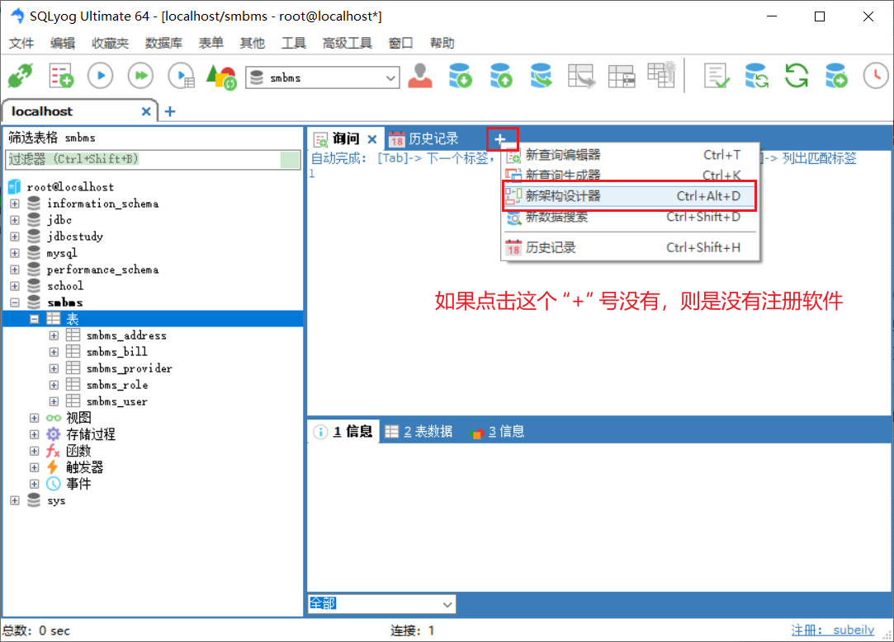


> 项目如何搭建？
>
> - 考虑是否使用Maven；

### 2.项目搭建

- 新建一个maven项目模块；


- 导入相应的web.xml文件；

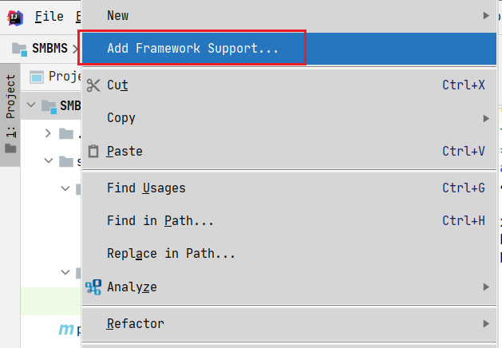


- 最后框架如图；

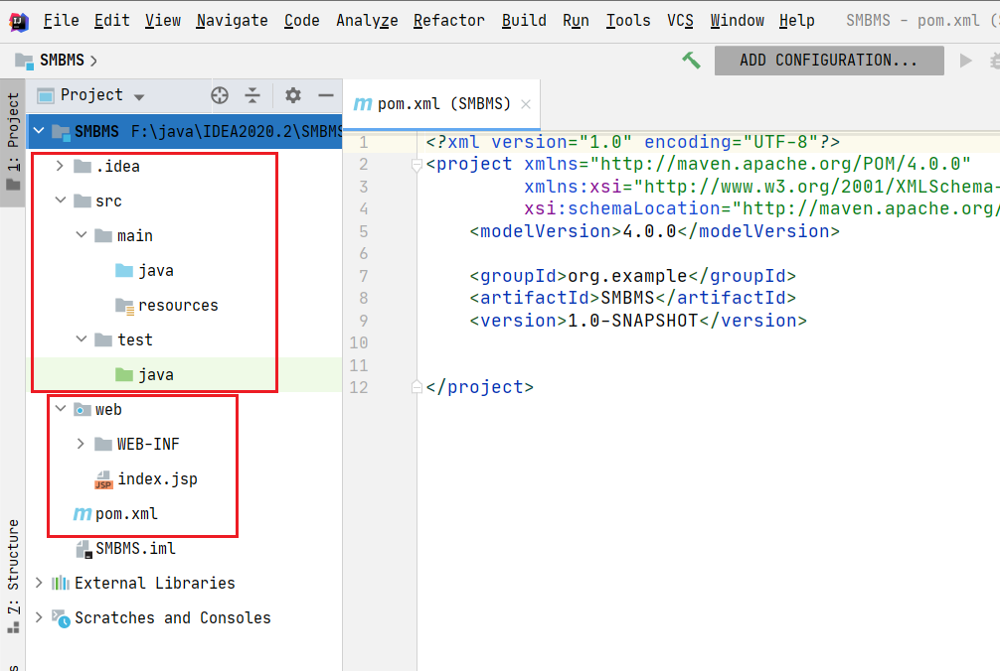

- 配置Tomcat；

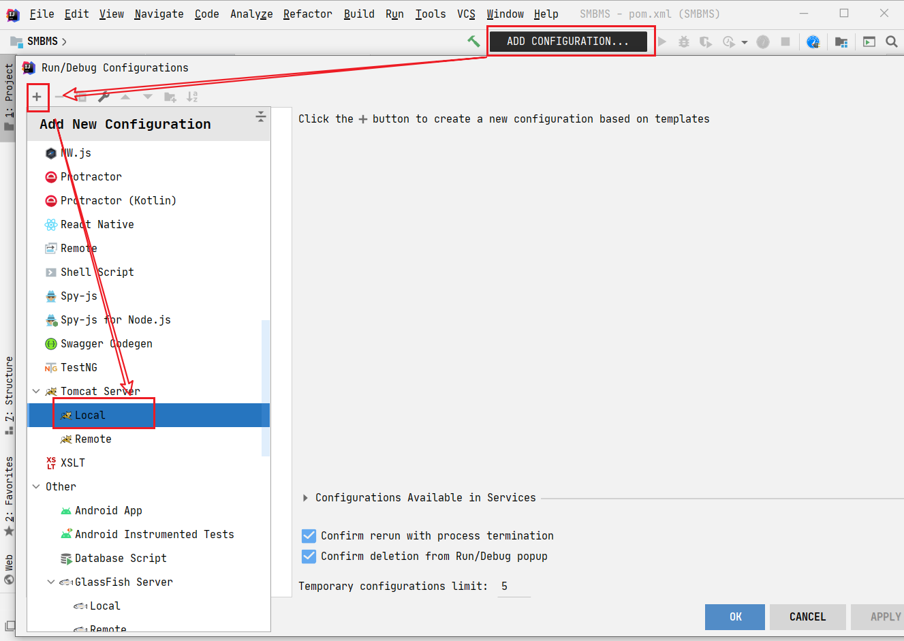

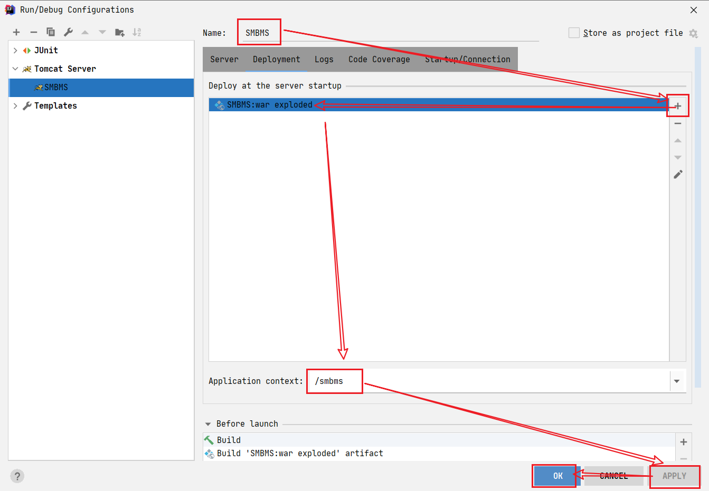

- 测试项目是否可运行：

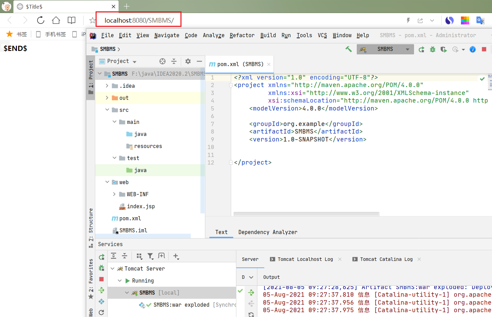

- 导入项目中需要的jar包——在==pom.xml==中，以maven方式导入；

```xml
<?xml version="1.0" encoding="UTF-8"?>
<project xmlns="http://maven.apache.org/POM/4.0.0"
         xmlns:xsi="http://www.w3.org/2001/XMLSchema-instance"
         xsi:schemaLocation="http://maven.apache.org/POM/4.0.0 http://maven.apache.org/xsd/maven-4.0.0.xsd">
    <modelVersion>4.0.0</modelVersion>

    <groupId>org.example</groupId>
    <artifactId>SMBMS</artifactId>
    <version>1.0-SNAPSHOT</version>

    <dependencies>
        <dependency>
            <groupId>javax.servlet</groupId>
            <artifactId>servlet-api</artifactId>
            <version>2.5</version>
        </dependency>
        <dependency>
            <groupId>javax.servlet.jsp</groupId>
            <artifactId>javax.servlet.jsp-api</artifactId>
            <version>2.3.3</version>
        </dependency>
        <dependency>
            <groupId>mysql</groupId>
            <artifactId>mysql-connector-java</artifactId>
            <version>5.1.47</version>
        </dependency>
        <dependency>
            <groupId>javax.servlet.jsp.jstl</groupId>
            <artifactId>jstl-api</artifactId>
            <version>1.2</version>
        </dependency>
        <dependency>
            <groupId>taglibs</groupId>
            <artifactId>standard</artifactId>
            <version>1.1.2</version>
        </dependency>
        <dependency>
            <groupId>org.projectlombok</groupId>
            <artifactId>lombok</artifactId>
            <version>1.18.20</version>
        </dependency>
        <dependency>
            <groupId>junit</groupId>
            <artifactId>junit</artifactId>
            <version>4.12</version>
        </dependency>
    </dependencies>

</project>
```

- 创建项目包结构
    - `pojo/entity`——实体类；
    - `dao`——具体数据库操作层(增删改查)；
    - `service`——业务层；
    - `test/view`——表示层 / 测试层；
    - `utils`——工具类；
    - `filter`——过滤层，放置过滤器；
    - `servlet`——控制层，调用业务层代码；

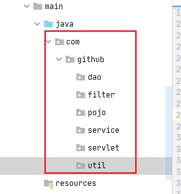

- 编写实体类
- User.java

```java
package com.github.pojo;

import lombok.Data;

import java.util.Date;

/**
 * 使用Lombok的jar包，可以不用写get/set、toString等方法
 */
@Data
public class User {
    private Integer id; // 主键ID
    private String userCode;    // 用户编码
    private String userName;    // 用户名称
    private String userPassword;    // 用户密码
    private Integer gender; // 性别
    private Date birthday;  // 出生日期
    private String phone;   // 手机
    private String address; // 地址
    private Integer userRole;   // 用户角色
    private Integer createdBy;  // 创建者
    private Date creationDate;  // 创建时间
    private Integer modifyBy;   // 更新者
    private Date modifyDate;    // 更新时间

    private Integer age;    // 年龄
    private String userRoleName;    // 用户角色名称

    public Integer getAge() {
        Date date = new Date();
        Integer age = date.getYear()-birthday.getYear();
        return age;
    }
}
```

- Bill.java

```java
package com.github.pojo;

import lombok.Data;

import java.math.BigDecimal;
import java.util.Date;

@Data
public class Bill {
    private Integer id; // 主键ID
    private String billCode;    // 账单编码
    private String productName; // 商品名称
    private String productDesc; // 商品描述
    private String productUnit; // 商品单位
    private BigDecimal productCount;   // 商品数量
    private BigDecimal totalPrice; // 商品总额
    private int isPayment;  // 是否支付
    private Integer createdBy;  // 创建者
    private Date creationDate;  //创建时间
    private Integer modifyBy;   // 更新者
    private Date modifyDate;    // 更新时间
    private String providerName; // 供应商名称
    private Integer providerId; // 供应商ID 

}
```

- Role.java

```java
package com.github.pojo;

import lombok.Data;

import java.util.Date;

@Data
public class Role {
    private Integer id; // 主键ID
    private String roleCode;    // 角色编码
    private String roleName;    // 角色名称
    private Integer createdBy;  // 创建者
    private Date creationDate;  // 创建时间
    private Integer modifyBy;   // 修改者
    private Date modifyDate;    // 修改时间

}
```

- Provider.java

```java
package com.github.pojo;

import lombok.Data;

import java.util.Date;

@Data
public class Provider {
    private Integer id;  // 主键ID
    private String proCode; // 供应商编码
    private String proName; // 供应商名称
    private String proDesc; // 供应商详细描述
    private String proContact;  // 供应商联系人
    private String proPhone;    // 联系电话
    private String proAddress;  // 地址
    private String proFax;  // 传真
    private Integer createdBy;   // 创建者
    private Date creationDate;    // 创建时间
    private Date modifyDate;  // 更新时间
    private Integer modifyBy;    //更新者

}
```

- 编写基础公共类

    1. 数据库配置文件——db.properties

  ```java
  driver=com.mysql.jdbc.Driver
  # 在和mysql传递数据的过程中，使用unicode编码格式，并且字符集设置为utf-8
  url=jdbc:mysql://localhost:3306/smbms?useSSL=true&useUnicode=true&characterEncoding=utf-8
  username=root
  password=root
  ```

    2. 编写数据库的公共类——BaseDao.java

  ```java
  package com.github.dao;
  
  import java.io.IOException;
  import java.io.InputStream;
  import java.sql.*;
  import java.util.Properties;
  
  /**
   * @Description: 操作数据库的公共类
   */
  public class BaseDao {
      private static String driver;
      private static String url;
      private static String username;
      private static String password;
  
      // 静态代码块,类加载时就初始化了
      static{
          Properties properties = new Properties();
          // 通过类加载器读取对应的资源
          InputStream is = BaseDao.class.getClassLoader().getResourceAsStream("db.properties");
  
          try{
              properties.load(is);
          } catch (IOException e) {
              e.printStackTrace();
          }
  
          driver = properties.getProperty("driver");
          url = properties.getProperty("url");
          username = properties.getProperty("username");
          password = properties.getProperty("password");
  
      }
  
      // 获取数据库的链接
      public static Connection getConnection(){
          Connection connection = null;
          try {
              Class.forName(driver);
              connection = DriverManager.getConnection(url, username, password);
          } catch (Exception e) {
              e.printStackTrace();
          }
          return connection;
      }
  
      // 编写查询公共类
      public static ResultSet execute(Connection connection,PreparedStatement preparedStatement , ResultSet rs, String sql, Object[] params) throws SQLException {
          // 预编译的SQL，在后面直接执行就行了
          preparedStatement = connection.prepareStatement(sql);
  
          for (int i = 0; i < params.length; i++) {
              // setObject,占位符从1开始，但是数组是从0开始
              preparedStatement.setObject(i+1,params[i]);
          }
  
          rs = preparedStatement.executeQuery();
          return rs;
      }
  
      // 编写查询公共类
      public static int execute(Connection connection, PreparedStatement preparedStatement, String sql, Object[] params) throws SQLException {
          preparedStatement = connection.prepareStatement(sql);
  
          for (int i = 0; i < params.length; i++) {
              // setObject,占位符从1开始，但是数组是从0开始
              preparedStatement.setObject(i+1,params[i]);
          }
  
          int updateRows = preparedStatement.executeUpdate();
          return updateRows;
      }
  
      // 释放资源
      public static boolean closeResult(Connection connection, PreparedStatement preparedStatement, ResultSet resultSet){
          boolean flag = true;
  
          if(resultSet != null){
              try {
                  resultSet.close();
                  // GC回收
                  resultSet = null;
              } catch (SQLException e) {
                  e.printStackTrace();
                  flag = false;
              }
          }
  
          if(preparedStatement != null){
              try {
                  preparedStatement.close();
                  // GC回收
                  preparedStatement = null;
              } catch (SQLException e) {
                  e.printStackTrace();
                  flag = false;
              }
          }
  
          if(connection != null){
              try {
                  connection.close();
                  // GC回收
                  connection = null;
              } catch (SQLException e) {
                  e.printStackTrace();
                  flag = false;
              }
          }
  
          return flag;
      }
  
  }
  ```

    3. 编写字符编码过滤；

  ```java
  package com.github.filter;
  
  import javax.servlet.*;
  import java.io.IOException;
  
  public class CharacterEncodingFilter implements Filter {
      public void init(FilterConfig filterConfig) throws ServletException {
  
      }
  
      public void doFilter(ServletRequest request, ServletResponse response, FilterChain chain) throws IOException, ServletException {
          request.setCharacterEncoding("UTF-8");
          response.setCharacterEncoding("UTF-8");
          response.setContentType("text/html;charset=UTF-8");
  
          chain.doFilter(request,response);
      }
  
      public void destroy() {
  
      }
  }
  ```

  ```xml
  <?xml version="1.0" encoding="UTF-8"?>
  <web-app xmlns="http://xmlns.jcp.org/xml/ns/javaee"
           xmlns:xsi="http://www.w3.org/2001/XMLSchema-instance"
           xsi:schemaLocation="http://xmlns.jcp.org/xml/ns/javaee http://xmlns.jcp.org/xml/ns/javaee/web-app_4_0.xsd"
           version="4.0">
  
  <!--  字符编码过滤器  -->
      <filter>
          <filter-name>/characterEncodingFilter</filter-name>
          <filter-class>com.github.filter.CharacterEncodingFilter</filter-class>
      </filter>
      <filter-mapping>
          <filter-name>/characterEncodingFilter</filter-name>
          <url-pattern>/*</url-pattern>
      </filter-mapping>
  
  </web-app>
  ```

    4. 导入相关前端素材；


## 2.登录流程实现

### 1.项目实现

- 框架流程


1. 编写前端页面——login.jsp；

```java
<%@ page contentType="text/html; charset=UTF-8"
    pageEncoding="UTF-8"%>
<!DOCTYPE html>
<html>
<head lang="en">
    <meta charset="UTF-8">
    <title>系统登录 - 超市订单管理系统</title>
    <link type="text/css" rel="stylesheet" href="${pageContext.request.contextPath }/css/style.css" />
    <script type="text/javascript">
	/* if(top.location!=self.location){
	      top.location=self.location;
	 } */
    </script>
</head>
<body class="login_bg">
    <section class="loginBox">
        <header class="loginHeader">
            <h1>超市订单管理系统</h1>
        </header>
        <section class="loginCont">
	        <form class="loginForm" action="${pageContext.request.contextPath }/login.do"  name="actionForm" id="actionForm"  method="post" >
				<div class="info">${error }</div>
				<div class="inputbox">
                    <label for="userCode">用户名：</label>
					<input type="text" class="input-text" id="userCode" name="userCode" placeholder="请输入用户名" required/>
				</div>	
				<div class="inputbox">
                    <label for="userPassword">密码：</label>
                    <input type="password" id="userPassword" name="userPassword" placeholder="请输入密码" required/>
                </div>	
				<div class="subBtn">
					
                    <input type="submit" value="登录"/>
                    <input type="reset" value="重置"/>
                </div>	
			</form>
        </section>
    </section>
</body>
</html>
```

2. 设置首页——web.xml；

```xml
<!--  设置欢迎页面  -->
    <welcome-file-list>
        <welcome-file>login.jsp</welcome-file>
    </welcome-file-list>
```

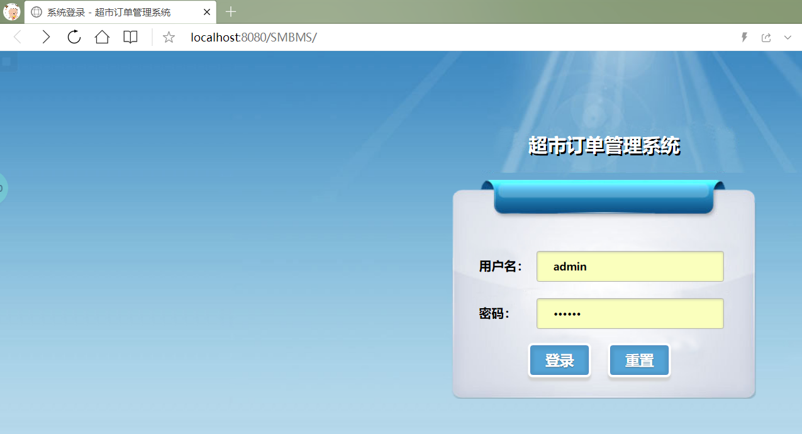

3. 编写dao层登录用户登录的接口；

```java
package com.github.dao.user;

import com.github.pojo.User;

import java.sql.Connection;

public interface UserDao {
    // 得到要登录的用户
    public User getLoginUser(Connection connection,String userCode) throws Exception;
}
```

4. 编写dao接口的实现类；

```java
package com.github.dao.user;

import com.github.dao.BaseDao;
import com.github.pojo.User;

import java.sql.Connection;
import java.sql.PreparedStatement;
import java.sql.ResultSet;

public class UserDaoImpl implements UserDao{

    public User getLoginUser(Connection connection, String userCode)
            throws Exception {
        PreparedStatement pstm = null;
        ResultSet rs = null;
        User user = null;

        if(connection != null) {
            String sql = "select * from smbms_user where userCode=?";
            Object[] params = {userCode};

            rs = BaseDao.execute(connection, pstm, rs, sql, params);

            if(rs.next()) {
                user = new User();
                user.setId(rs.getInt("id"));
                user.setUserCode(rs.getString("userCode"));
                user.setUserName(rs.getString("userName"));
                user.setUserPassword(rs.getString("userPassword"));
                user.setGender(rs.getInt("gender"));
                user.setBirthday(rs.getDate("birthday"));
                user.setPhone(rs.getString("phone"));
                user.setAddress(rs.getString("address"));
                user.setUserRole(rs.getInt("userRole"));
                user.setCreatedBy(rs.getInt("createdBy"));
                user.setCreationDate(rs.getTimestamp("creationDate"));
                user.setModifyBy(rs.getInt("modifyBy"));
                user.setModifyDate(rs.getTimestamp("modifyDate"));
            }
            BaseDao.closeResult(null,pstm,rs);
        }

        return user;
    }
}
```

5. 业务层接口

```java
package com.github.service.user;

import com.github.pojo.User;

public interface UserService {
    // 用户登录
    public User login(String userCode, String userPassword);
}
```

6. 业务实现类

```java
package com.github.service.user;

import com.github.dao.BaseDao;
import com.github.dao.user.UserDao;
import com.github.dao.user.UserDaoImpl;
import com.github.pojo.User;
import org.junit.Test;

import java.sql.Connection;

public class UserServiceImpl implements UserService{
    // 业务层都会调用dao层，所以需要引入Dao层
    private UserDao userDao;
    public UserServiceImpl(){
        userDao = new UserDaoImpl();
    }

    public User login(String userCode, String userPassword) {
        Connection connection = null;
        User user = null;

        try {
            connection = BaseDao.getConnection();
            // 通过业务层调用对应的具体的数据库操作
            user = userDao.getLoginUser(connection,userCode);
        } catch (Exception e) {
            e.printStackTrace();
        } finally {
            BaseDao.closeResult(connection,null,null);
        }
        
        // 匹配密码
		if(null != user){
			if(!user.getUserPassword().equals(userPassword))
				user = null;
		}
        
        return user;
    }

    @Test
    public void test(){
        UserServiceImpl userService = new UserServiceImpl();
        User admin = userService.login("admin", "1234gjhgjhg56");
        System.out.println(admin.getUserPassword());
    }
}
```


7. 编写Servlet

```java
package com.github.servlet.user;

import com.github.pojo.User;
import com.github.service.user.UserServiceImpl;
import com.github.util.Constants;

import javax.servlet.ServletException;
import javax.servlet.http.HttpServlet;
import javax.servlet.http.HttpServletRequest;
import javax.servlet.http.HttpServletResponse;
import java.io.IOException;

public class LoginServlet extends HttpServlet {
    // servlet:控制层，调用 业务层代码
    @Override
    protected void doGet(HttpServletRequest req, HttpServletResponse resp) throws ServletException, IOException {
        super.doGet(req,resp);
    }

    @Override
    protected void doPost(HttpServletRequest req, HttpServletResponse resp) throws ServletException, IOException {
        System.out.println("--------LoginServlet----------");
        // 获取用户名和密码
        String userCode = req.getParameter("userCode");
        String userPassword = req.getParameter("userPassword");

        // 调用业务层，进行用户密码匹配
        UserServiceImpl userService = new UserServiceImpl();
        User user = userService.login(userCode, userPassword);

        if(user != null){   // 登录成功
            // 将用户信息放入session
            req.getSession().setAttribute(Constants.USER_SESSION,user);
            // 页面跳转 —— frame.jsp
            resp.sendRedirect("jsp/frame.jsp");
        } else {
            // 页面跳转 —— login.jsp
            req.setAttribute("error","用户名或密码错误！");
            req.getRequestDispatcher("login.jsp").forward(req,resp);
        }
    }
}
```

```java
package com.github.util;

public class Constants {
    public final static String USER_SESSION = "userSession";
}
```

8. 注册servlet

```xml
<!--   servlet  -->
    <servlet>
        <servlet-name>LoginServlet</servlet-name>
        <servlet-class>com.github.servlet.user.LoginServlet</servlet-class>
    </servlet>
    <servlet-mapping>
        <servlet-name>LoginServlet</servlet-name>
        <url-pattern>/login.do</url-pattern>
    </servlet-mapping>
```

9. 测试访问，确保以上功能成功！


### 2.产生报错及解决

> 如果登录后，左上角时间显示乱码，请修改==head.jsp==文件，具体代码如下：

```jsp
<%@ page contentType="text/html; charset=UTF-8"	pageEncoding="UTF-8"%>
<%@ taglib uri="http://java.sun.com/jsp/jstl/core" prefix="c" %>
<%@ taglib uri="http://java.sun.com/jsp/jstl/fmt" prefix="fmt" %>	
<!DOCTYPE html>
<html>
<head lang="en">
    <meta charset="UTF-8">
    <title>超市订单管理系统</title>
    <link type="text/css" rel="stylesheet" href="${pageContext.request.contextPath }/css/style.css" />
    <link type="text/css" rel="stylesheet" href="${pageContext.request.contextPath }/css/public.css" />
    <script>
        function tick() {
            var today=new Date();
            var month=today.getMonth()+1;<!--getMonth显示当前月份-1，所以要+1才能显示当前月份-->
            var year, date, hours, minutes, seconds;
            var intHours, intMinutes, intSeconds;
            var week=new Array()
            // 显示几天为星期几
            week[0]="星期天 ";
            week[1]="星期一 ";
            week[2]="星期二 ";
            week[3]="星期三 ";
            week[4]="星期四 ";
            week[5]="星期五 ";
            week[6]="星期六 ";
            intHours = today.getHours();
            intMinutes = today.getMinutes();
            intSeconds = today.getSeconds();
            year=today.getFullYear();
            date=today.getDate();
            var time;
            if (intHours == 0) {
                hours = "00:";
            }
            else if (intHours < 10) {
                hours = "0" + intHours+":";
            }
            else {
                hours = intHours + ":";
            }
            if (intMinutes < 10) {
                minutes = "0"+intMinutes+":";
            }
            else {
                minutes = intMinutes+":";
            }
            if (intSeconds < 10) {
                seconds = "0"+intSeconds+" ";
            }
            else {
                seconds = intSeconds+" ";
            }
//根据不同的时间显示不同的问候。
//下面采用自己总结的测试纠正法对time进行赋值
            time="午夜好";
            if(today.getHours()<=22)  time="晚上好";
            if(today.getHours()<=19)  time="傍晚好";
            if(today.getHours()<=17)  time="下午好";
            if(today.getHours()<=14)  time="中午好";
            if(today.getHours()<=12)  time="上午好";
            if(today.getHours()<=8)   time="早上好";
            if(today.getHours()<=5)   time="凌晨好";
            timeString="今天是："+year+"年"+month+"月"+date+"日  "+hours+minutes+seconds+week[today.getDay()]+time;
            Clock.innerHTML = timeString;
            window.setTimeout("tick();", 1000);
        }
        window.onload = tick;
    </script>
</head>
<body>
<!--头部-->
    <header class="publicHeader">
        <h1>超市订单管理系统</h1>
        <div class="publicHeaderR">
            <p><span>下午好！</span><span style="color: #fff21b"> ${userSession.userName }</span> , 欢迎你！</p>
            <a href="${pageContext.request.contextPath }/jsp/logout.do">退出</a>
        </div>
    </header>
<!--时间-->
    <section class="publicTime">
        <span id="Clock"></span>
        <a href="#">温馨提示：为了能正常浏览，请使用高版本浏览器！（IE10+）</a>
    </section>
 <!--主体内容-->
 <section class="publicMian ">
     <div class="left">
         <h2 class="leftH2"><span class="span1"></span>功能列表 <span></span></h2>
         <nav>
             <ul class="list">
                 <li ><a href="${pageContext.request.contextPath }/jsp/bill.do?method=query">订单管理</a></li>
              <li><a href="${pageContext.request.contextPath }/jsp/provider.do?method=query">供应商管理</a></li>
              <li><a href="${pageContext.request.contextPath }/jsp/user.do?method=query">用户管理</a></li>
              <li><a href="${pageContext.request.contextPath }/jsp/pwdmodify.jsp">密码修改</a></li>
              <li><a href="${pageContext.request.contextPath }/jsp/logout.do">退出系统</a></li>
             </ul>
         </nav>
     </div>
     <input type="hidden" id="path" name="path" value="${pageContext.request.contextPath }"/>
     <input type="hidden" id="referer" name="referer" value="<%=request.getHeader("Referer")%>"/>
```

> 报错：`java.lang.ClassNotFoundException: com.mysql.jdbc.Driver`

- 是tomcat找不到MYSQL JAR包的问题。
- 解决方法：把mysql-connector-java-5.1.47-bin.jar拷贝到tomcat下lib目录就可以了。
    - 下载地址：[Maven](https://repo1.maven.org/maven2/mysql/mysql-connector-java/5.1.47/mysql-connector-java-5.1.47.jar)。

>网页显示报错：`此URL不支持Http方法POST`

- 解决方法：将 .java 文件中的 doGet 改成 doPost ；


## 3.注销及权限过滤

> 注销功能：移除session，返回登录页面。

- 编写Servlet类

```java
package com.github.servlet.user;

import com.github.util.Constants;

import javax.servlet.ServletException;
import javax.servlet.http.HttpServlet;
import javax.servlet.http.HttpServletRequest;
import javax.servlet.http.HttpServletResponse;
import java.io.IOException;

public class LogoutServlet extends HttpServlet {

    @Override
    protected void doGet(HttpServletRequest req, HttpServletResponse resp) throws ServletException, IOException {
        // 移除session
        req.getSession().removeAttribute(Constants.USER_SESSION);
        resp.sendRedirect(req.getContextPath() + "/login.jsp");
    }

    @Override
    protected void doPost(HttpServletRequest req, HttpServletResponse resp) throws ServletException, IOException {

    }

}
```

- 注册servlet

```xml
    <servlet>
        <servlet-name>LogoutServlet</servlet-name>
        <servlet-class>com.github.servlet.user.LogoutServlet</servlet-class>
    </servlet>
    <servlet-mapping>
        <servlet-name>LogoutServlet</servlet-name>
        <url-pattern>/jsp/logout.do</url-pattern>
    </servlet-mapping>
```

> 登录拦截优化

```java
package com.github.filter;

import com.github.pojo.User;

import javax.servlet.*;
import javax.servlet.http.HttpServletRequest;
import javax.servlet.http.HttpServletResponse;
import java.io.IOException;

public class SysFilter implements Filter {
    public void init(FilterConfig filterConfig) throws ServletException {

    }

    public void doFilter(ServletRequest request, ServletResponse response, FilterChain chain) throws IOException, ServletException {

        System.out.println("-------SysFilter--------");
        HttpServletRequest rq = (HttpServletRequest) request;
        HttpServletResponse rp = (HttpServletResponse) response;
        User userSession = (User) rq.getSession().getAttribute("userSession");
        if(userSession == null){
            rp.sendRedirect("/smbms/error.jsp");
        } else {
            chain.doFilter(request,response);
        }

    }

    public void destroy() {

    }
}
```

- error.jsp

```jsp
<%@ page contentType="text/html; charset=UTF-8"
    pageEncoding="UTF-8"%>
<!DOCTYPE html PUBLIC "-//W3C//DTD HTML 4.01 Transitional//EN" "http://www.w3.org/TR/html4/loose.dtd">
<html>
<head>
<meta http-equiv="Content-Type" content="text/html; charset=UTF-8">
<title>Insert title here</title>
</head>
<body>
<h1>请登录后再访问该页面！</h1>
<a href="login.jsp">返回</a>
</body>
</html>
```

- 注册filter

```xml
<!--  用户登录过滤器  -->
    <filter>
        <filter-name>SysFilter</filter-name>
        <filter-class>com.github.filter.SysFilter</filter-class>
    </filter>
    <filter-mapping>
        <filter-name>SysFilter</filter-name>
        <url-pattern>/jsp/*</url-pattern>
    </filter-mapping>
```

- 运行结果

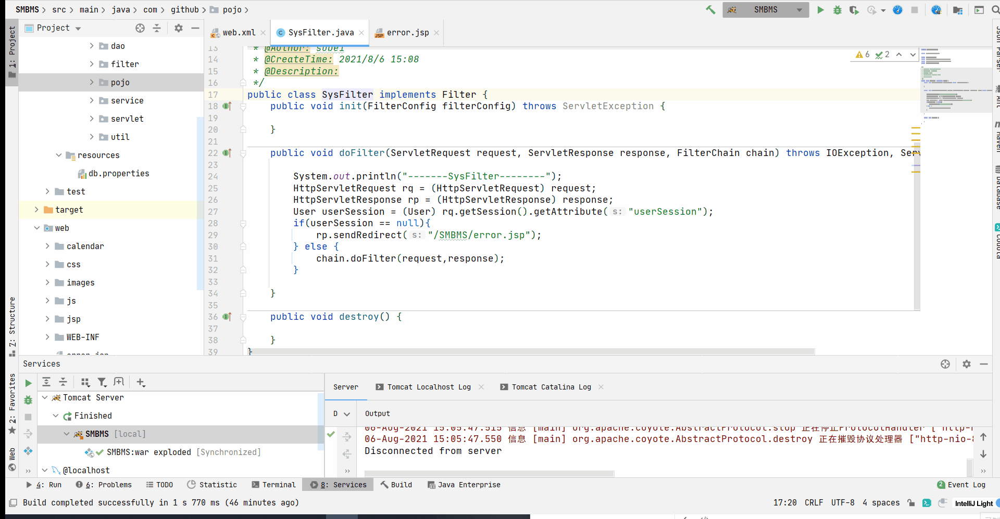

## 4.密码实现修改

1. 导入前端素材；
    - /jsp/pwdmodify.jsp

```jsp
<li><a href="${pageContext.request.contextPath }/jsp/user.do?method=query">用户管理</a></li>
```

2. 从底层开始编写；

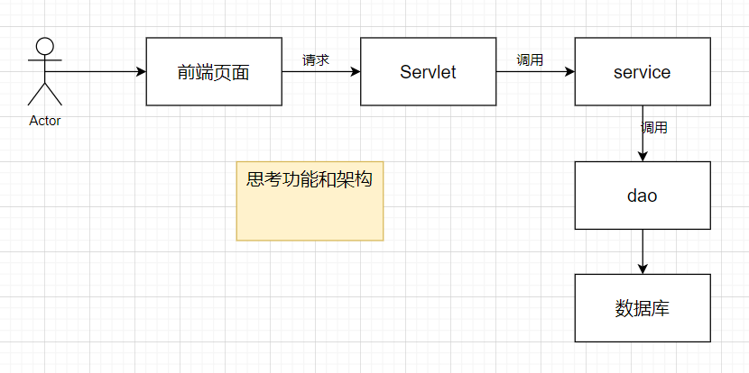

3. 编写Dao层接口

```java
package com.github.dao.user;

import com.github.pojo.User;

import java.sql.Connection;
import java.sql.SQLException;

public interface UserDao {
    // 得到要登录的用户
    public User getLoginUser(Connection connection,String userCode) throws SQLException;

    // 修改当前用户密码
    public int updatePwd(Connection connection,int id,String pwd) throws SQLException;

}
```

4. UserDao 接口实现类

```java
package com.github.dao.user;

import com.github.dao.BaseDao;
import com.github.pojo.User;

import java.sql.Connection;
import java.sql.PreparedStatement;
import java.sql.ResultSet;
import java.sql.SQLException;

public class UserDaoImpl implements UserDao{

    // 得到要登录的用户
    public User getLoginUser(Connection connection, String userCode)
            throws SQLException {
        PreparedStatement pstm = null;
        ResultSet rs = null;
        User user = null;

        if(connection != null) {
            String sql = "select * from smbms_user where userCode=?";
            Object[] params = {userCode};

            rs = BaseDao.execute(connection, pstm, rs, sql, params);

            if(rs.next()) {
                user = new User();
                user.setId(rs.getInt("id"));
                user.setUserCode(rs.getString("userCode"));
                user.setUserName(rs.getString("userName"));
                user.setUserPassword(rs.getString("userPassword"));
                user.setGender(rs.getInt("gender"));
                user.setBirthday(rs.getDate("birthday"));
                user.setPhone(rs.getString("phone"));
                user.setAddress(rs.getString("address"));
                user.setUserRole(rs.getInt("userRole"));
                user.setCreatedBy(rs.getInt("createdBy"));
                user.setCreationDate(rs.getTimestamp("creationDate"));
                user.setModifyBy(rs.getInt("modifyBy"));
                user.setModifyDate(rs.getTimestamp("modifyDate"));
            }
            BaseDao.closeResult(null,pstm,rs);
        }

        return user;
    }

    // 修改当前用户密码
    public int updatePwd(Connection connection, int id, String pwd) throws SQLException {
        System.out.println("UserServlet1:"+pwd);

        PreparedStatement pstm = null;
        int flag = 0;
        if(connection != null){
            String sql = "update smbms_user set userPassword= ? where id = ?";
            Object[] params = {pwd,id};
            flag = BaseDao.execute(connection, pstm, sql, params);
            BaseDao.closeResult(null, pstm, null);
        }
        return flag;
    }
}
```

5. 编写service层接口

```java
package com.github.service.user;

import com.github.pojo.User;

public interface UserService {
    // 用户登录
    public User login(String userCode, String userPassword);

    // 根据user修改密码
    public boolean updatePwd(int id,String pwd);
}
```

6. UserService 接口实现类

```java
package com.github.service.user;

import com.github.dao.BaseDao;
import com.github.dao.user.UserDao;
import com.github.dao.user.UserDaoImpl;
import com.github.pojo.User;
import org.junit.Test;

import java.sql.Connection;
import java.sql.SQLException;

public class UserServiceImpl implements UserService{
    // 业务层都会调用dao层，所以需要引入Dao层
    private UserDao userDao;
    public UserServiceImpl(){
        userDao = new UserDaoImpl();
    }

    public User login(String userCode, String userPassword) {
        Connection connection = null;
        User user = null;

        try {
            connection = BaseDao.getConnection();
            // 通过业务层调用对应的具体的数据库操作
            user = userDao.getLoginUser(connection,userCode);
        } catch (Exception e) {
            e.printStackTrace();
        } finally {
            BaseDao.closeResult(connection,null,null);
        }

        // 匹配密码
        if(null != user) {
            if (!user.getUserPassword().equals(userPassword)) {
                user = null;
            }
        }

        return user;
    }

    public boolean updatePwd(int id, String pwd) {
        System.out.println("UserServlet2:" + pwd);

        boolean flag = false;
        Connection connection = null;
        try{
            connection = BaseDao.getConnection();
            if(userDao.updatePwd(connection,id,pwd) > 0) {
                flag = true;
            }
        }catch (Exception e) {
            e.printStackTrace();
        }finally{
            BaseDao.closeResult(connection, null, null);
        }
        return flag;
    }
}
```

7. 编写servlet层

```java
package com.github.servlet.user;

import com.github.pojo.User;
import com.github.service.user.UserService;
import com.github.service.user.UserServiceImpl;
import com.github.util.Constants;
import com.mysql.jdbc.StringUtils;

import javax.servlet.ServletException;
import javax.servlet.http.HttpServlet;
import javax.servlet.http.HttpServletRequest;
import javax.servlet.http.HttpServletResponse;
import java.io.IOException;

/**
 * @Description: 实现servlet复用
 */
public class UserServlet extends HttpServlet {
    @Override
    protected void doGet(HttpServletRequest request, HttpServletResponse response) throws ServletException, IOException {
        super.doPost(request,response);
    }

    @Override
    protected void doPost(HttpServletRequest request, HttpServletResponse response) throws ServletException, IOException {
        String method = request.getParameter("method");

        System.out.println("method----> " + method);

        if(method != null && method.equals("savepwd")){
            this.updatePwd(request, response);
        }
    }

    public void updatePwd(HttpServletRequest request, HttpServletResponse response) throws ServletException, IOException {
        // 从Session中取ID
        Object o = request.getSession().getAttribute(Constants.USER_SESSION);
        String newpassword = request.getParameter("newpassword");

        System.out.println("UserServlet3:"+newpassword);

        boolean flag = false;

        if(o != null && !StringUtils.isNullOrEmpty(newpassword)){
            UserService userService = new UserServiceImpl();
            flag = userService.updatePwd(((User)o).getId(),newpassword);
            if(flag){
                request.setAttribute(Constants.SYS_MESSAGE, "修改密码成功,请退出并使用新密码重新登录！");
                // 密码修改成功，session注销
                request.getSession().removeAttribute(Constants.USER_SESSION);
            }else{
                request.setAttribute(Constants.SYS_MESSAGE, "修改密码失败！");
            }
        }else{
            request.setAttribute(Constants.SYS_MESSAGE, "修改密码失败！");
        }
        request.getRequestDispatcher("pwdmodify.jsp").forward(request, response);
    }

}
```

8. 注册servlet

```xml
    <servlet>
        <servlet-name>UserServlet</servlet-name>
        <servlet-class>com.github.servlet.user.UserServlet</servlet-class>
    </servlet>
    <servlet-mapping>
        <servlet-name>UserServlet</servlet-name>
        <url-pattern>/jsp/user.do</url-pattern>
    </servlet-mapping>
```

9. 由于验证旧密码的实现在下一节，此处需要修改前端界面代码如下：
    - pwdmodify.js


- pwdmodify.jsp

```jsp
<%@ page contentType="text/html; charset=UTF-8"
         pageEncoding="UTF-8"%>
<%@include file="/jsp/common/head.jsp"%>
<div class="right">
    <div class="location">
        <strong>你现在所在的位置是:</strong>
        <span>密码修改页面</span>
    </div>
    <div class="providerAdd">
        <form id="userForm" name="userForm" method="post" action="${pageContext.request.contextPath }/jsp/user.do">
            <input type="hidden" name="method" value="savepwd">
            <!--div的class 为error是验证错误，ok是验证成功-->
            <div class="info">${message}</div>
            <%--<div class="">--%>
            <%--    <label for="oldPassword">旧密码：</label>--%>
            <%--    <input type="password" name="oldpassword" id="oldpassword" value="">--%>
            <%--    <font color="red"></font>--%>
            <%--</div>--%>
            <div>
                <label for="newPassword">新密码：</label>
                <input type="password" name="newpassword" id="newpassword" value="">
                <font color="red"></font>
            </div>
            <div>
                <label for="rnewpassword">确认新密码：</label>
                <input type="password" name="rnewpassword" id="rnewpassword" value="">
                <font color="red"></font>
            </div>
            <div class="providerAddBtn">
                <!--<a href="#">保存</a>-->
                <input type="button" name="save" id="save" value="保存" class="input-button">
            </div>
        </form>
    </div>
</div>
</section>
<%@include file="/jsp/common/foot.jsp" %>
<script type="text/javascript" src="${pageContext.request.contextPath }/js/pwdmodify.js"></script>
```

10. 测试代码

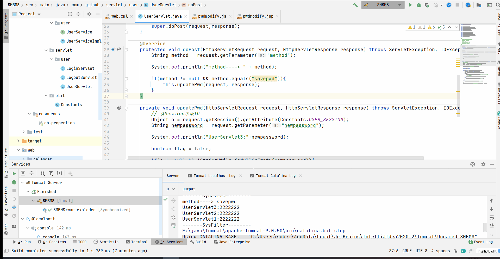

## 5.Ajax验证旧密码实现

1. 使用阿里巴巴的fastjson

```xml
<!-- https://mvnrepository.com/artifact/com.alibaba/fastjson -->
<dependency>
    <groupId>com.alibaba</groupId>
    <artifactId>fastjson</artifactId>
    <version>1.2.76</version>
</dependency>
```

- 注意：`在导入maven的同时，请将相应的jar包放入Tomcat的lib目录下`！

2. 修改前端页面

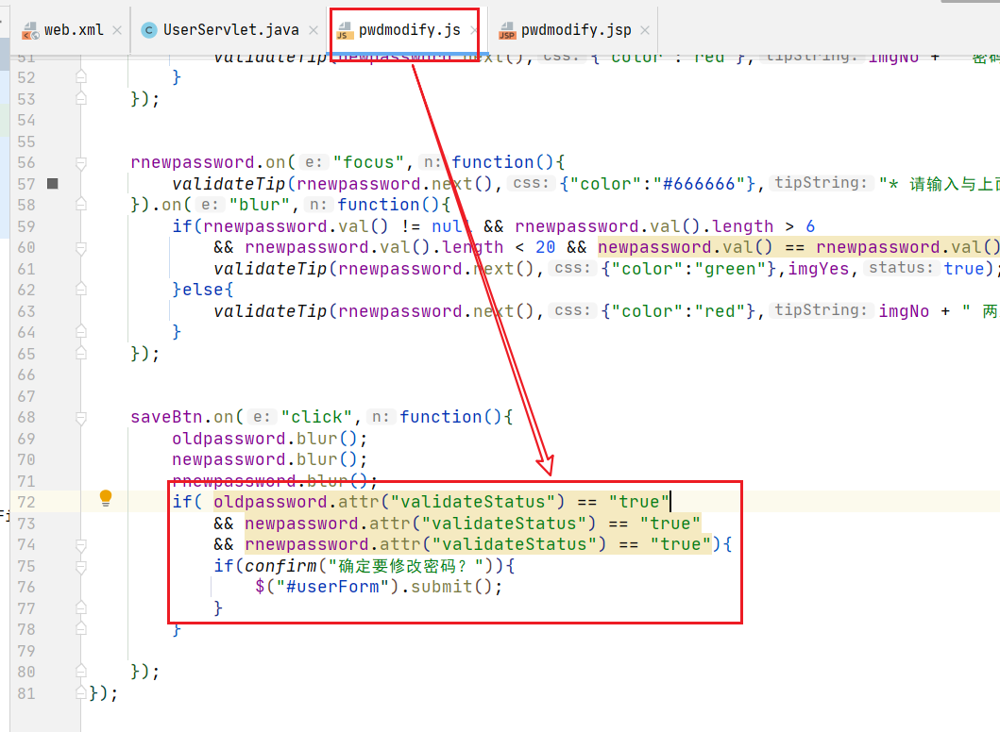

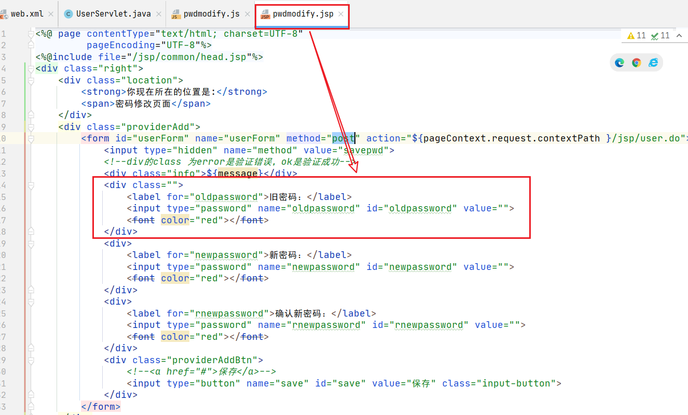

3. 添加修改旧密码的servlet类

```java
package com.github.servlet.user;

import com.alibaba.fastjson.JSONArray;
import com.github.pojo.User;
import com.github.service.user.UserService;
import com.github.service.user.UserServiceImpl;
import com.github.util.Constants;
import com.mysql.jdbc.StringUtils;

import javax.servlet.ServletException;
import javax.servlet.http.HttpServlet;
import javax.servlet.http.HttpServletRequest;
import javax.servlet.http.HttpServletResponse;
import java.io.IOException;
import java.io.PrintWriter;
import java.util.HashMap;
import java.util.Map;

public class UserServlet extends HttpServlet {
    @Override
    protected void doGet(HttpServletRequest request, HttpServletResponse response) throws ServletException, IOException {
        String method = request.getParameter("method");

        System.out.println("method----> " + method);

        if(method != null && method.equals("savepwd")){
            this.updatePwd(request, response);
        } else if(method.equals("pwdmodify") && method!=null){
            this.pwdModify(request,response);
        }
    }

    @Override
    protected void doPost(HttpServletRequest request, HttpServletResponse response) throws ServletException, IOException {
        String method = request.getParameter("method");

        System.out.println("method----> " + method);

        if(method != null && method.equals("savepwd")){
            this.updatePwd(request, response);
        } else if(method.equals("pwdmodify") && method!=null){
            this.pwdModify(request,response);
        }
    }

    // 修改密码
    public void updatePwd(HttpServletRequest request, HttpServletResponse response) throws ServletException, IOException {
        // 从Session中取ID
        Object o = request.getSession().getAttribute(Constants.USER_SESSION);
        String newpassword = request.getParameter("newpassword");

        System.out.println("UserServlet3:"+newpassword);

        boolean flag = false;

        if(o != null && !StringUtils.isNullOrEmpty(newpassword)){
            UserService userService = new UserServiceImpl();
            flag = userService.updatePwd(((User)o).getId(),newpassword);
            if(flag){
                request.setAttribute(Constants.SYS_MESSAGE, "修改密码成功,请退出并使用新密码重新登录！");
                // 密码修改成功，session注销
                request.getSession().removeAttribute(Constants.USER_SESSION);
            }else{
                request.setAttribute(Constants.SYS_MESSAGE, "修改密码失败！");
            }
        }else{
            request.setAttribute(Constants.SYS_MESSAGE, "修改密码失败！");
        }
        request.getRequestDispatcher("pwdmodify.jsp").forward(request, response);
    }

    // 验证旧密码,session中有用户的密码
    public void pwdModify(HttpServletRequest req, HttpServletResponse resp) throws IOException {

        // 从Session中取ID
        Object o = req.getSession().getAttribute(Constants.USER_SESSION);
        String oldpassword = req.getParameter("oldpassword");
        Map<String, String> resultMap = new HashMap<String, String>();

        // session过期
        if(null == o ){
            resultMap.put("result", "sessionerror");
        }else if(StringUtils.isNullOrEmpty(oldpassword)){
            // 旧密码输入为空
            resultMap.put("result", "error");
        }else{
            String sessionPwd = ((User)o).getUserPassword();
            if(oldpassword.equals(sessionPwd)){
                resultMap.put("result", "true");
            }else{
                // 旧密码输入不正确
                resultMap.put("result", "false");
            }
        }

        resp.setContentType("application/json");
        PrintWriter outWriter = resp.getWriter();
        // JSONArray 阿里巴巴的JSON工具类
        outWriter.write(JSONArray.toJSONString(resultMap));
        outWriter.flush();
        outWriter.close();

    }

}
```

- 由于==网页经常报错405==。

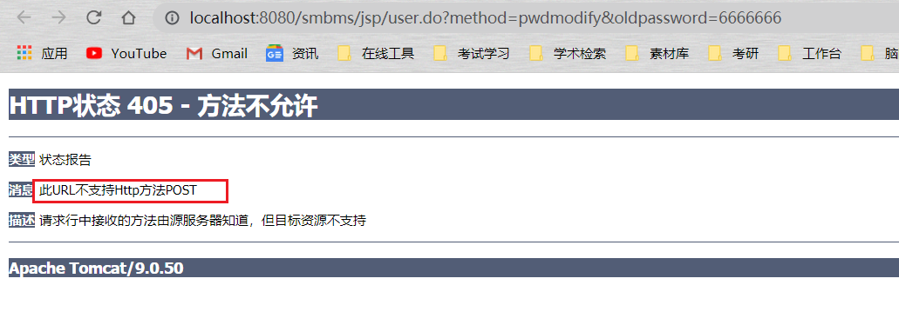

- 解决方法：`dopost，doget两个方法都写，使dopost，doget进行互换即可`。如果有更好的方法，请留言指正！

4. 添加默认Session过期时间；

```xml
<!--  默认Session过期时间:真实业务请求  -->
    <session-config>
        <session-timeout>30</session-timeout>
    </session-config>
```

5. 测试运行


## 6.用户管理实现

- 思路框架


1. 导入分页工具类——`PageSupport.java`；

```java
package com.github.util;

public class PageSupport {
    // 当前页码-来自于用户输入
    private int currentPageNo = 1;

    // 总数量（表）
    private int totalCount = 0;

    // 页面容量
    private int pageSize = 0;

    // 总页数-totalCount/pageSize（+1）
    private int totalPageCount = 1;

    public int getCurrentPageNo() {
        return currentPageNo;
    }

    public void setCurrentPageNo(int currentPageNo) {
        if(currentPageNo > 0){
            this.currentPageNo = currentPageNo;
        }
    }

    public int getTotalCount() {
        return totalCount;
    }

    public void setTotalCount(int totalCount) {
        if(totalCount > 0){
            this.totalCount = totalCount;
            // 设置总页数
            this.setTotalPageCountByRs();
        }
    }
    public int getPageSize() {
        return pageSize;
    }

    public void setPageSize(int pageSize) {
        if(pageSize > 0){
            this.pageSize = pageSize;
        }
    }

    public int getTotalPageCount() {
        return totalPageCount;
    }

    public void setTotalPageCount(int totalPageCount) {
        this.totalPageCount = totalPageCount;
    }

    public void setTotalPageCountByRs(){
        if(this.totalCount % this.pageSize == 0){
            this.totalPageCount = this.totalCount / this.pageSize;
        }else if(this.totalCount % this.pageSize > 0){
            this.totalPageCount = this.totalCount / this.pageSize + 1;
        }else{
            this.totalPageCount = 0;
        }
    }
}
```

2. 用户列表页面导入；

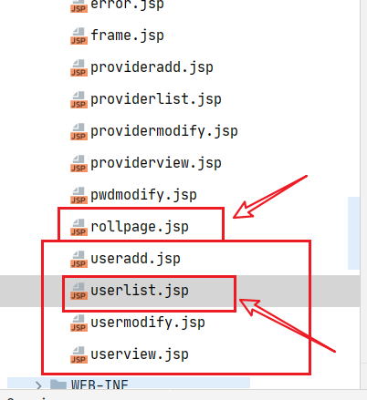

### 1.获取用户数量

1. UserDao.java

```java
    // 查询用户总数
    public int getUserCount(Connection connection, String userName, int userRole)throws Exception;
```

2. UserDaoImpl.java

```java
    // 根据用户名或角色查询用户总数
    public int getUserCount(Connection connection, String userName, int userRole) throws Exception {

        PreparedStatement pstm = null;
        ResultSet rs = null;
        int count=0;

        if(connection!=null){
            StringBuffer sql = new StringBuffer();
            sql.append("select count(1) as count from smbms_user u,smbms_role r where u.userRole = r.id");
            // 存放参数
            List<Object> list = new ArrayList<Object>();

            if(!StringUtils.isNullOrEmpty(userName)){
                sql.append(" and u.userName like ?");
                // index:0
                list.add("%" + userName + "%");
            }

            if(userRole>0){
                sql.append(" and u.userRole = ?");
                // index:1
                list.add(userRole);
            }

            // 将List转换为数组
            Object[] prams = list.toArray();
            // 输出最后拼接后的sql语句
            System.out.println("sql----->" + sql.toString());
            rs = BaseDao.execute(connection,pstm,rs,sql.toString(),prams);

            // 从结果集中获取最后的数量
            if(rs.next()){
                count = rs.getInt("count");
            }

            BaseDao.closeResult(null,pstm,rs);
        }

        return count;
    }
```

3. UserService.java

```java
    // 根据条件查询出用户表记录数
    public int getUserCount(String queryUserName, int queryUserRole);
```

4. UserServiceImpl.java

```java
    // 
    public int getUserCount(String queryUserName, int queryUserRole) {
        int count = 0;
        Connection connection = null;

        System.out.println("queryUserName----->" + queryUserName);
        System.out.println("queryUserRole----->" + queryUserRole);

        try {
            connection = BaseDao.getConnection();
            count = userDao.getUserCount(connection,queryUserName,queryUserRole);
        } catch (Exception e) {
            e.printStackTrace();
        } finally {
            BaseDao.closeResult(connection,null,null);
        }

        return count;
    }
```

### 2.获取用户列表

1. UserDao.java

```java
    // 通过条件查询-userList
    public List<User> getUserList(Connection connection, String userName, int userRole, int currentPageNo, int pageSize)throws Exception;
```

2. UserDaoImpl.java

```java
	public List<User> getUserList(Connection connection, String userName, int userRole, int currentPageNo, int pageSize) throws Exception {
        PreparedStatement pstm = null;
        ResultSet rs = null;
        List<User> userList = new ArrayList<User>();
        if(connection != null){
            StringBuffer sql = new StringBuffer();
            sql.append("select u.*,r.roleName as userRoleName from smbms_user u,smbms_role r where u.userRole = r.id");
            List<Object> list = new ArrayList<Object>();
            if(!StringUtils.isNullOrEmpty(userName)){
                sql.append(" and u.userName like ?");
                list.add("%"+userName+"%");
            }
            if(userRole > 0){
                sql.append(" and u.userRole = ?");
                list.add(userRole);
            }
            sql.append(" order by creationDate DESC limit ?,?");
            currentPageNo = (currentPageNo-1)*pageSize;
            list.add(currentPageNo);
            list.add(pageSize);

            Object[] params = list.toArray();
            System.out.println("sql ----> " + sql.toString());
            rs = BaseDao.execute(connection, pstm, rs, sql.toString(), params);
            while(rs.next()){
                User _user = new User();
                _user.setId(rs.getInt("id"));
                _user.setUserCode(rs.getString("userCode"));
                _user.setUserName(rs.getString("userName"));
                _user.setGender(rs.getInt("gender"));
                _user.setBirthday(rs.getDate("birthday"));
                _user.setPhone(rs.getString("phone"));
                _user.setUserRole(rs.getInt("userRole"));
                _user.setUserRoleName(rs.getString("userRoleName"));
                userList.add(_user);
            }
            BaseDao.closeResult(null, pstm, rs);
        }
        return userList;
    }
```

3. UserService.java

```java
    // 根据条件查询用户列表
    public List<User> getUserList(String queryUserName, int queryUserRole, int currentPageNo, int pageSize);
```

4. UserServiceImpl.java

```java
    public List<User> getUserList(String queryUserName, int queryUserRole, int currentPageNo, int pageSize) {
        Connection connection = null;
        List<User> userList = null;
        System.out.println("queryUserName ---- > " + queryUserName);
        System.out.println("queryUserRole ---- > " + queryUserRole);
        System.out.println("currentPageNo ---- > " + currentPageNo);
        System.out.println("pageSize ---- > " + pageSize);
        try {
            connection = BaseDao.getConnection();
            userList = userDao.getUserList(connection, queryUserName,queryUserRole,currentPageNo,pageSize);
        } catch (Exception e) {
            e.printStackTrace();
        }finally{
            BaseDao.closeResult(connection, null, null);
        }
        return userList;
    }
```

### 3.获取角色列表

> 为了职责统一，可以把角色的操作单独放在一个包中，与pojo类对应！

1. UserDao.java

```java
package com.github.dao.role;

import com.github.pojo.Role;

import java.sql.Connection;
import java.sql.SQLException;
import java.util.List;

public interface RoleDao {
    // 获取角色列表
    public List<Role> getRoleList(Connection connection) throws SQLException;
    
}
```

2. UserDaoImpl.java

```java
package com.github.dao.role;

import com.github.dao.BaseDao;
import com.github.pojo.Role;

import java.sql.Connection;
import java.sql.PreparedStatement;
import java.sql.ResultSet;
import java.sql.SQLException;
import java.util.ArrayList;
import java.util.List;

public class RoleDaoImpl implements RoleDao{
    
    // 获取角色列表
    public List<Role> getRoleList(Connection connection) throws SQLException {

        PreparedStatement pstm = null;
        ResultSet resultSet = null;
        ArrayList<Role> roleList = new ArrayList<Role>();

        if(connection!=null){
            String sql = "select * from smbms_role";
            Object[] params = {};
            resultSet = BaseDao.execute(connection,pstm,resultSet,sql,params);

            while(resultSet.next()){
                Role _role = new Role();
                _role.setId(resultSet.getInt("id"));
                _role.setRoleName(resultSet.getString("roleName"));
                _role.setRoleCode(resultSet.getString("roleCode"));
                roleList.add(_role);
            }
            BaseDao.closeResult(null,pstm,resultSet);
        }

        return roleList;
    }
}
```

3. UserService.java

```java
package com.github.service.role;

import com.github.pojo.Role;

import java.util.List;

public interface RoleService {
    // 获取用户角色
    public List<Role> getRoleList();
    
}
```

4. UserServiceImpl.java

```java
package com.github.service.role;

import com.github.dao.BaseDao;
import com.github.dao.role.RoleDao;
import com.github.dao.role.RoleDaoImpl;
import com.github.pojo.Role;

import java.sql.Connection;
import java.util.List;

public class RoleServiceImpl implements RoleService{
    private RoleDao roleDao;

    public RoleServiceImpl(){
        roleDao = new RoleDaoImpl();
    }

    public List<Role> getRoleList() {
        Connection connection = null;
        List<Role> roleList = null;
        try {
            connection = BaseDao.getConnection();
            roleList = roleDao.getRoleList(connection);
        } catch (Exception e) {
            e.printStackTrace();
        }finally{
            BaseDao.closeResult(connection, null, null);
        }
        return roleList;
    }
}
```

### 4.用户显示的Servlet

1. 获取用户前端数据(查询)；
2. 判断请求是否需要执行，看参数的值判断；
3. 为了实现分页，需要计算出当前页面、总页面和页面大小……
4. 用户列表展示；
5. 返回前端。
    - UserServlet.java

```java
package com.github.servlet.user;

import com.alibaba.fastjson.JSONArray;
import com.github.pojo.Role;
import com.github.pojo.User;
import com.github.service.role.RoleService;
import com.github.service.role.RoleServiceImpl;
import com.github.service.user.UserService;
import com.github.service.user.UserServiceImpl;
import com.github.util.Constants;
import com.github.util.PageSupport;
import com.mysql.jdbc.StringUtils;

import javax.servlet.ServletException;
import javax.servlet.http.HttpServlet;
import javax.servlet.http.HttpServletRequest;
import javax.servlet.http.HttpServletResponse;
import java.io.IOException;
import java.io.PrintWriter;
import java.util.HashMap;
import java.util.List;
import java.util.Map;

public class UserServlet extends HttpServlet {
    @Override
    protected void doGet(HttpServletRequest request, HttpServletResponse response) throws ServletException, IOException {
        String method = request.getParameter("method");

        System.out.println("method----> " + method);

        if(method != null && method.equals("savepwd")){
            this.updatePwd(request, response);
        } else if(method.equals("pwdmodify") && method!=null){
            this.pwdModify(request,response);
        } else if(method != null && method.equals("query")) {
            this.query(request,response);
        }
    }

    @Override
    protected void doPost(HttpServletRequest request, HttpServletResponse response) throws ServletException, IOException {
        String method = request.getParameter("method");

        System.out.println("method----> " + method);

        if(method != null && method.equals("savepwd")){
            this.updatePwd(request, response);
        } else if(method.equals("pwdmodify") && method!=null){
            this.pwdModify(request,response);
        } else if(method != null && method.equals("query")) {
            this.query(request,response);
        }
    }

    // 修改密码
    public void updatePwd(HttpServletRequest request, HttpServletResponse response) throws ServletException, IOException {
        // 从Session中取ID
        Object o = request.getSession().getAttribute(Constants.USER_SESSION);
        String newpassword = request.getParameter("newpassword");

        System.out.println("UserServlet3:"+newpassword);

        boolean flag = false;

        if(o != null && !StringUtils.isNullOrEmpty(newpassword)){
            UserService userService = new UserServiceImpl();
            flag = userService.updatePwd(((User)o).getId(),newpassword);
            if(flag){
                request.setAttribute(Constants.SYS_MESSAGE, "修改密码成功,请退出并使用新密码重新登录！");
                // 密码修改成功，session注销
                request.getSession().removeAttribute(Constants.USER_SESSION);
            }else{
                request.setAttribute(Constants.SYS_MESSAGE, "修改密码失败！");
            }
        }else{
            request.setAttribute(Constants.SYS_MESSAGE, "修改密码失败！");
        }
        request.getRequestDispatcher("pwdmodify.jsp").forward(request, response);
    }

    // 验证旧密码,session中有用户的密码
    public void pwdModify(HttpServletRequest req, HttpServletResponse resp) throws IOException {

        // 从Session中取ID
        Object o = req.getSession().getAttribute(Constants.USER_SESSION);
        String oldpassword = req.getParameter("oldpassword");
        Map<String, String> resultMap = new HashMap<String, String>();

        // session过期
        if(null == o ){
            resultMap.put("result", "sessionerror");
        }else if(StringUtils.isNullOrEmpty(oldpassword)){
            // 旧密码输入为空
            resultMap.put("result", "error");
        }else{
            String sessionPwd = ((User)o).getUserPassword();
            if(oldpassword.equals(sessionPwd)){
                resultMap.put("result", "true");
            }else{
                // 旧密码输入不正确
                resultMap.put("result", "false");
            }
        }

        resp.setContentType("application/json");
        PrintWriter outWriter = resp.getWriter();
        // JSONArray 阿里巴巴的JSON工具类
        outWriter.write(JSONArray.toJSONString(resultMap));
        outWriter.flush();
        outWriter.close();

    }

    // 用户管理
    public void query(HttpServletRequest request, HttpServletResponse response)
            throws ServletException, IOException {
        // 查询用户列表
        String queryUserName = request.getParameter("queryname");
        String temp = request.getParameter("queryUserRole");
        String pageIndex = request.getParameter("pageIndex");
        int queryUserRole = 0;
        UserService userService = new UserServiceImpl();
        List<User> userList = null;

        // 设置页面容量
        int pageSize = Constants.pageSize;

        // 当前页码
        int currentPageNo = 1;
        /**
         * http://localhost:8090/SMBMS/userlist.do
         * ----queryUserName --NULL
         * http://localhost:8090/SMBMS/userlist.do?queryname=
         * --queryUserName ---""
         */
        System.out.println("queryUserName servlet-------->"+queryUserName);
        System.out.println("queryUserRole servlet-------->"+queryUserRole);
        System.out.println("query pageIndex----------> " + pageIndex);

        if(queryUserName == null){
            queryUserName = "";
        }
        if(temp != null && !temp.equals("")){
            queryUserRole = Integer.parseInt(temp);
        }

        if(pageIndex != null){
            try{
                currentPageNo = Integer.valueOf(pageIndex);
            }catch(NumberFormatException e){
                response.sendRedirect("error.jsp");
            }
        }
        // 总数量（表）
        int totalCount	= userService.getUserCount(queryUserName,queryUserRole);
        // 总页数
        PageSupport pages=new PageSupport();
        pages.setCurrentPageNo(currentPageNo);
        pages.setPageSize(pageSize);
        pages.setTotalCount(totalCount);

        int totalPageCount = pages.getTotalPageCount();

        // 控制首页和尾页
        if(currentPageNo < 1){
            currentPageNo = 1;
        }else if(currentPageNo > totalPageCount){
            currentPageNo = totalPageCount;
        }
        

        userList = userService.getUserList(queryUserName,queryUserRole,currentPageNo, pageSize);
        request.setAttribute("userList", userList);
        List<Role> roleList = null;
        RoleService roleService = new RoleServiceImpl();
        roleList = roleService.getRoleList();
        request.setAttribute("roleList", roleList);
        request.setAttribute("queryUserName", queryUserName);
        request.setAttribute("queryUserRole", queryUserRole);
        request.setAttribute("totalPageCount", totalPageCount);
        request.setAttribute("totalCount", totalCount);
        request.setAttribute("currentPageNo", currentPageNo);
        request.getRequestDispatcher("userlist.jsp").forward(request, response);
    }
}
```

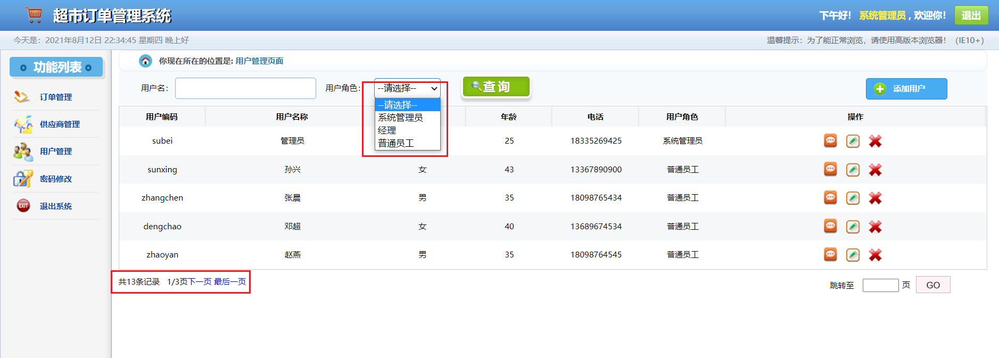

## 7.架构分析及实现

- 整体架构

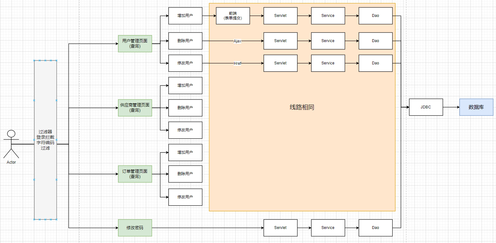

### 1.用户管理

1. 用户增删改查接口——UserDao.java

```java
    // 增加用户信息
    public int add(Connection connection, User user)throws Exception;

    // 通过userId删除user
    public int deleteUserById(Connection connection, Integer delId)throws Exception;

    // 修改用户信息
    public int modify(Connection connection, User user)throws Exception;

    // 通过userId查询user
    public User getUserById(Connection connection, String id)throws Exception;
```

2. 用户接口实现类——UserDaoImpl.java

```java
    // 增加用户信息
    public int add(Connection connection, User user) throws Exception {
        PreparedStatement pstm = null;
        int updateRows = 0;
        if(null != connection){
            String sql = "insert into smbms_user (userCode,userName,userPassword," +
                    "userRole,gender,birthday,phone,address,creationDate,createdBy) " +
                    "values(?,?,?,?,?,?,?,?,?,?)";
            Object[] params = {user.getUserCode(),user.getUserName(),user.getUserPassword(),
                    user.getUserRole(),user.getGender(),user.getBirthday(),
                    user.getPhone(),user.getAddress(),user.getCreationDate(),user.getCreatedBy()};
            updateRows = BaseDao.execute(connection, pstm, sql, params);
            BaseDao.closeResult(null, pstm, null);
        }
        return updateRows;
    }

    // 通过userId删除user
    public int deleteUserById(Connection connection, Integer delId) throws Exception {
        PreparedStatement pstm = null;
        int flag = 0;
        if(null != connection){
            String sql = "delete from smbms_user where id=?";
            Object[] params = {delId};
            flag = BaseDao.execute(connection, pstm, sql, params);
            BaseDao.closeResult(null, pstm, null);
        }
        return flag;
    }

    // 修改用户信息
    public int modify(Connection connection, User user) throws Exception {
        int flag = 0;
        PreparedStatement pstm = null;
        if(null != connection){
            String sql = "update smbms_user set userName=?,"+
                    "gender=?,birthday=?,phone=?,address=?,userRole=?,modifyBy=?,modifyDate=? where id = ? ";
            Object[] params = {user.getUserName(),user.getGender(),user.getBirthday(),
                    user.getPhone(),user.getAddress(),user.getUserRole(),user.getModifyBy(),
                    user.getModifyDate(),user.getId()};
            flag = BaseDao.execute(connection, pstm, sql, params);
            BaseDao.closeResult(null, pstm, null);
        }
        return flag;
    }

    // 通过userId查询user
    public User getUserById(Connection connection, String id) throws Exception {
        User user = null;
        PreparedStatement pstm = null;
        ResultSet rs = null;
        if(null != connection){
            String sql = "select u.*,r.roleName as userRoleName from smbms_user u,smbms_role r where u.id=? and u.userRole = r.id";
            Object[] params = {id};
            rs = BaseDao.execute(connection, pstm, rs, sql, params);
            if(rs.next()){
                user = new User();
                user.setId(rs.getInt("id"));
                user.setUserCode(rs.getString("userCode"));
                user.setUserName(rs.getString("userName"));
                user.setUserPassword(rs.getString("userPassword"));
                user.setGender(rs.getInt("gender"));
                user.setBirthday(rs.getDate("birthday"));
                user.setPhone(rs.getString("phone"));
                user.setAddress(rs.getString("address"));
                user.setUserRole(rs.getInt("userRole"));
                user.setCreatedBy(rs.getInt("createdBy"));
                user.setCreationDate(rs.getTimestamp("creationDate"));
                user.setModifyBy(rs.getInt("modifyBy"));
                user.setModifyDate(rs.getTimestamp("modifyDate"));
                user.setUserRoleName(rs.getString("userRoleName"));
            }
            BaseDao.closeResult(null, pstm, rs);
        }
        return user;
    }
```

3. service层接口——UserService.java

```java
    // 增加用户信息
    public boolean add(User user);

    // 通过userId删除user
    public boolean deleteUserById(Integer delId);

    // 修改用户信息
    public boolean modify(User user);

    // 通过userId查询user
    public User getUserById(String id);

    // 根据userCode查询出User
    public User selectUserCodeExist(String userCode);
```

4. service层接口实现类——UserServiceImpl.java

```java
    // 增加用户信息
    public boolean add(User user) {
        boolean flag = false;
        Connection connection = null;
        try {
            connection = BaseDao.getConnection();
            // 开启JDBC事务管理
            connection.setAutoCommit(false);
            int updateRows = userDao.add(connection,user);
            connection.commit();
            if(updateRows > 0){
                flag = true;
                System.out.println("add success!");
            }else{
                System.out.println("add failed!");
            }

        } catch (Exception e) {
            e.printStackTrace();
            try {
                System.out.println("rollback==================");
                connection.rollback();
            } catch (SQLException e1) {
                e1.printStackTrace();
            }
        }finally{
            // 在service层进行connection连接的关闭
            BaseDao.closeResult(connection, null, null);
        }
        return flag;
    }

    // 通过userId删除user
    public boolean deleteUserById(Integer delId) {
        Connection connection = null;
        boolean flag = false;
        try {
            connection = BaseDao.getConnection();
            if(userDao.deleteUserById(connection,delId) > 0) {
                flag = true;
            }
        } catch (Exception e) {
            e.printStackTrace();
        }finally{
            BaseDao.closeResult(connection, null, null);
        }
        return flag;
    }

    // 修改用户信息
    public boolean modify(User user) {
        Connection connection = null;
        boolean flag = false;
        try {
            connection = BaseDao.getConnection();
            if(userDao.modify(connection,user) > 0) {
                flag = true;
            }
        } catch (Exception e) {
            e.printStackTrace();
        }finally{
            BaseDao.closeResult(connection, null, null);
        }
        return flag;
    }

    // 通过userId查询user
    public User getUserById(String id) {
        User user = null;
        Connection connection = null;
        try{
            connection = BaseDao.getConnection();
            user = userDao.getUserById(connection,id);
        }catch (Exception e) {
            e.printStackTrace();
            user = null;
        }finally{
            BaseDao.closeResult(connection, null, null);
        }
        return user;
    }

    // 根据userCode查询出User
    public User selectUserCodeExist(String userCode) {
        Connection connection = null;
        User user = null;
        try {
            connection = BaseDao.getConnection();
            user = userDao.getLoginUser(connection, userCode);
        } catch (Exception e) {
            e.printStackTrace();
        }finally{
            BaseDao.closeResult(connection, null, null);
        }
        return user;
    }
```

5. servlet层——UserServlet.java

```java
package com.github.servlet.user;

import com.alibaba.fastjson.JSONArray;
import com.github.pojo.Role;
import com.github.pojo.User;
import com.github.service.role.RoleService;
import com.github.service.role.RoleServiceImpl;
import com.github.service.user.UserService;
import com.github.service.user.UserServiceImpl;
import com.github.util.Constants;
import com.github.util.PageSupport;
import com.mysql.jdbc.StringUtils;

import java.io.IOException;
import java.io.PrintWriter;
import java.text.ParseException;
import java.text.SimpleDateFormat;
import java.util.*;

import javax.servlet.ServletException;
import javax.servlet.http.HttpServlet;
import javax.servlet.http.HttpServletRequest;
import javax.servlet.http.HttpServletResponse;

public class UserServlet extends HttpServlet {

    @Override
    protected void doGet(HttpServletRequest request, HttpServletResponse response) throws ServletException, IOException {

        String method = request.getParameter("method");
        System.out.println("method----> " + method);

        if(method != null && method.equals("savepwd")){
            this.updatePwd(request, response);
        } else if(method.equals("pwdmodify") && method!=null){
            this.pwdModify(request,response);
        } else if(method != null && method.equals("query")) {
            this.query(request,response);
        } else if(method != null && method.equals("add")){
            this.add(request, response);
        } else if(method != null && method.equals("getrolelist")){
            this.getRoleList(request, response);
        } else if(method != null && method.equals("ucexist")){
            this.userCodeExist(request, response);
        } else if(method != null && method.equals("deluser")){
            this.delUser(request, response);
        } else if(method != null && method.equals("view")){
            this.getUserById(request, response,"userview.jsp");
        } else if(method != null && method.equals("modify")){
            this.getUserById(request, response,"usermodify.jsp");
        } else if(method != null && method.equals("modifyexe")){
            this.modify(request, response);
        }
    }

    @Override
    protected void doPost(HttpServletRequest request, HttpServletResponse response) throws ServletException, IOException {

        String method = request.getParameter("method");
        System.out.println("method----> " + method);

        if(method != null && method.equals("savepwd")){
            this.updatePwd(request, response);
        } else if(method.equals("pwdmodify") && method!=null){
            this.pwdModify(request,response);
        } else if(method != null && method.equals("query")) {
            this.query(request,response);
        } else if(method != null && method.equals("add")){
            this.add(request, response);
        } else if(method != null && method.equals("getrolelist")){
            this.getRoleList(request, response);
        } else if(method != null && method.equals("ucexist")){
            this.userCodeExist(request, response);
        } else if(method != null && method.equals("deluser")){
            this.delUser(request, response);
        } else if(method != null && method.equals("view")){
            this.getUserById(request, response,"userview.jsp");
        } else if(method != null && method.equals("modify")){
            this.getUserById(request, response,"usermodify.jsp");
        } else if(method != null && method.equals("modifyexe")){
            this.modify(request, response);
        }
    }

    // 修改密码
    public void updatePwd(HttpServletRequest request, HttpServletResponse response) throws ServletException, IOException {
        // 从Session中取ID
        Object o = request.getSession().getAttribute(Constants.USER_SESSION);
        String newpassword = request.getParameter("newpassword");

        System.out.println("UserServlet3:"+newpassword);

        boolean flag = false;

        if(o != null && !StringUtils.isNullOrEmpty(newpassword)){
            UserService userService = new UserServiceImpl();
            flag = userService.updatePwd(((User)o).getId(),newpassword);
            if(flag){
                request.setAttribute(Constants.SYS_MESSAGE, "修改密码成功,请退出并使用新密码重新登录！");
                // 密码修改成功，session注销
                request.getSession().removeAttribute(Constants.USER_SESSION);
            }else{
                request.setAttribute(Constants.SYS_MESSAGE, "修改密码失败！");
            }
        }else{
            request.setAttribute(Constants.SYS_MESSAGE, "修改密码失败！");
        }
        request.getRequestDispatcher("pwdmodify.jsp").forward(request, response);
    }

    // 验证旧密码,session中有用户的密码
    public void pwdModify(HttpServletRequest req, HttpServletResponse resp) throws IOException {

        // 从Session中取ID
        Object o = req.getSession().getAttribute(Constants.USER_SESSION);
        String oldpassword = req.getParameter("oldpassword");
        Map<String, String> resultMap = new HashMap<String, String>();

        // session过期
        if(null == o ){
            resultMap.put("result", "sessionerror");
        }else if(StringUtils.isNullOrEmpty(oldpassword)){
            // 旧密码输入为空
            resultMap.put("result", "error");
        }else{
            String sessionPwd = ((User)o).getUserPassword();
            if(oldpassword.equals(sessionPwd)){
                resultMap.put("result", "true");
            }else{
                // 旧密码输入不正确
                resultMap.put("result", "false");
            }
        }

        resp.setContentType("application/json");
        PrintWriter outWriter = resp.getWriter();
        // JSONArray 阿里巴巴的JSON工具类
        outWriter.write(JSONArray.toJSONString(resultMap));
        outWriter.flush();
        outWriter.close();

    }

    // 用户管理
    public void query(HttpServletRequest request, HttpServletResponse response)
            throws ServletException, IOException {
        // 查询用户列表
        String queryUserName = request.getParameter("queryname");
        String temp = request.getParameter("queryUserRole");
        String pageIndex = request.getParameter("pageIndex");
        int queryUserRole = 0;
        UserService userService = new UserServiceImpl();
        List<User> userList = null;

        // 设置页面容量
        int pageSize = Constants.pageSize;

        // 当前页码
        int currentPageNo = 1;
        /**
         * http://localhost:8090/SMBMS/userlist.do
         * ----queryUserName --NULL
         * http://localhost:8090/SMBMS/userlist.do?queryname=
         * --queryUserName ---""
         */
        System.out.println("queryUserName servlet-------->"+queryUserName);
        System.out.println("queryUserRole servlet-------->"+queryUserRole);
        System.out.println("query pageIndex----------> " + pageIndex);

        if(queryUserName == null){
            queryUserName = "";
        }
        if(temp != null && !temp.equals("")){
            queryUserRole = Integer.parseInt(temp);
        }

        if(pageIndex != null){
            try{
                currentPageNo = Integer.valueOf(pageIndex);
            }catch(NumberFormatException e){
                response.sendRedirect("error.jsp");
            }
        }

        // 获取用户总数
        int totalCount	= userService.getUserCount(queryUserName,queryUserRole);

        // 总页数
        PageSupport pages=new PageSupport();
        pages.setCurrentPageNo(currentPageNo);
        pages.setPageSize(pageSize);
        pages.setTotalCount(totalCount);

        int totalPageCount = pages.getTotalPageCount();

        // 控制首页和尾页
        if(currentPageNo < 1){
            currentPageNo = 1;
        }else if(currentPageNo > totalPageCount){
            currentPageNo = totalPageCount;
        }


        userList = userService.getUserList(queryUserName,queryUserRole,currentPageNo, pageSize);
        request.setAttribute("userList", userList);
        List<Role> roleList = null;
        RoleService roleService = new RoleServiceImpl();
        roleList = roleService.getRoleList();
        request.setAttribute("roleList", roleList);
        request.setAttribute("queryUserName", queryUserName);
        request.setAttribute("queryUserRole", queryUserRole);
        request.setAttribute("totalPageCount", totalPageCount);
        request.setAttribute("totalCount", totalCount);
        request.setAttribute("currentPageNo", currentPageNo);
        request.getRequestDispatcher("userlist.jsp").forward(request, response);
    }

    // 增加用户
    public void add(HttpServletRequest request, HttpServletResponse response)
            throws ServletException, IOException {

        System.out.println("add()================");
        String userCode = request.getParameter("userCode");
        String userName = request.getParameter("userName");
        String userPassword = request.getParameter("userPassword");
        String gender = request.getParameter("gender");
        String birthday = request.getParameter("birthday");
        String phone = request.getParameter("phone");
        String address = request.getParameter("address");
        String userRole = request.getParameter("userRole");

        User user = new User();
        user.setUserCode(userCode);
        user.setUserName(userName);
        user.setUserPassword(userPassword);
        user.setAddress(address);
        try {
            user.setBirthday(new SimpleDateFormat("yyyy-MM-dd").parse(birthday));
        } catch (ParseException e) {
            e.printStackTrace();
        }
        user.setGender(Integer.valueOf(gender));
        user.setPhone(phone);
        user.setUserRole(Integer.valueOf(userRole));
        user.setCreationDate(new Date());
        user.setCreatedBy(((User)request.getSession().getAttribute(Constants.USER_SESSION)).getId());

        UserService userService = new UserServiceImpl();
        if(userService.add(user)){
            response.sendRedirect(request.getContextPath()+"/jsp/user.do?method=query");
        }else{
            request.getRequestDispatcher("useradd.jsp").forward(request, response);
        }

    }

    // 删除用户
    public void delUser(HttpServletRequest request, HttpServletResponse response)
            throws IOException {
        String id = request.getParameter("uid");
        Integer delId = 0;
        try{
            delId = Integer.parseInt(id);
        }catch (Exception e) {
            delId = 0;
        }
        HashMap<String, String> resultMap = new HashMap<String, String>();
        if(delId <= 0){
            resultMap.put("delResult", "notexist");
        }else{
            UserService userService = new UserServiceImpl();
            if(userService.deleteUserById(delId)){
                resultMap.put("delResult", "true");
            }else{
                resultMap.put("delResult", "false");
            }
        }

        // 把resultMap转换成json对象输出
        response.setContentType("application/json");
        PrintWriter outPrintWriter = response.getWriter();
        outPrintWriter.write(JSONArray.toJSONString(resultMap));
        outPrintWriter.flush();
        outPrintWriter.close();
    }

    // 修改用户信息
    public void modify(HttpServletRequest request, HttpServletResponse response)
            throws ServletException, IOException {
        String id = request.getParameter("uid");
        String userName = request.getParameter("userName");
        String gender = request.getParameter("gender");
        String birthday = request.getParameter("birthday");
        String phone = request.getParameter("phone");
        String address = request.getParameter("address");
        String userRole = request.getParameter("userRole");

        User user = new User();
        user.setId(Integer.valueOf(id));
        user.setUserName(userName);
        user.setGender(Integer.valueOf(gender));
        try {
            user.setBirthday(new SimpleDateFormat("yyyy-MM-dd").parse(birthday));
        } catch (ParseException e) {
            e.printStackTrace();
        }
        user.setPhone(phone);
        user.setAddress(address);
        user.setUserRole(Integer.valueOf(userRole));
        user.setModifyBy(((User)request.getSession().getAttribute(Constants.USER_SESSION)).getId());
        user.setModifyDate(new Date());

        UserService userService = new UserServiceImpl();
        if(userService.modify(user)){
            response.sendRedirect(request.getContextPath()+"/jsp/user.do?method=query");
        }else{
            request.getRequestDispatcher("usermodify.jsp").forward(request, response);
        }

    }

    // 通过userId查询user
    public void getUserById(HttpServletRequest request, HttpServletResponse response,String url)
            throws ServletException, IOException {

        String id = request.getParameter("uid");
        if(!StringUtils.isNullOrEmpty(id)){
            // 调用后台方法得到user对象
            UserService userService = new UserServiceImpl();
            User user = userService.getUserById(id);
            request.setAttribute("user", user);
            request.getRequestDispatcher(url).forward(request, response);
        }

    }

    // 根据userCode查询出User
    private void userCodeExist(HttpServletRequest request, HttpServletResponse response)
            throws ServletException, IOException {
        // 判断用户账号是否可用
        String userCode = request.getParameter("userCode");

        HashMap<String, String> resultMap = new HashMap<String, String>();
        if(StringUtils.isNullOrEmpty(userCode)){
            // userCode == null || userCode.equals("")
            resultMap.put("userCode", "exist");
        }else{
            UserService userService = new UserServiceImpl();
            User user = userService.selectUserCodeExist(userCode);
            if(null != user){
                resultMap.put("userCode","exist");
            }else{
                resultMap.put("userCode", "notexist");
            }
        }

        // 把resultMap转为json字符串以json的形式输出
        // 配置上下文的输出类型
        response.setContentType("application/json");
        // 从response对象中获取往外输出的writer对象
        PrintWriter outPrintWriter = response.getWriter();
        // 把resultMap转为json字符串 输出
        outPrintWriter.write(JSONArray.toJSONString(resultMap));
        outPrintWriter.flush(); // 刷新
        outPrintWriter.close(); // 关闭流
    }

    private void getRoleList(HttpServletRequest request, HttpServletResponse response)
            throws ServletException, IOException {
        List<Role> roleList = null;
        RoleService roleService = new RoleServiceImpl();
        roleList = roleService.getRoleList();
        // 把roleList转换成json对象输出
        response.setContentType("application/json");
        PrintWriter outPrintWriter = response.getWriter();
        outPrintWriter.write(JSONArray.toJSONString(roleList));
        outPrintWriter.flush();
        outPrintWriter.close();
    }

}
```

6. 运行调试


### 2.订单管理

1. dao层接口及实现类

```java
package com.github.dao.bill;

import com.github.pojo.Bill;

import java.sql.Connection;
import java.util.List;

public interface BillDao {
    // 增加订单
    public int add(Connection connection, Bill bill)throws Exception;

    // 通过查询条件获取供应商列表-模糊查询-getBillList
    public List<Bill> getBillList(Connection connection, Bill bill)throws Exception;

    //通过delId删除Bill
    public int deleteBillById(Connection connection, String delId)throws Exception;

    // 通过billId获取Bill
    public Bill getBillById(Connection connection, String id)throws Exception;

    // 修改订单信息
    public int modify(Connection connection, Bill bill)throws Exception;

    // 根据供应商ID查询订单数量
    public int getBillCountByProviderId(Connection connection, String providerId)throws Exception;

}
```

```java
package com.github.dao.bill;

import com.github.dao.BaseDao;
import com.github.pojo.Bill;
import com.mysql.jdbc.StringUtils;

import java.sql.Connection;
import java.sql.PreparedStatement;
import java.sql.ResultSet;
import java.util.ArrayList;
import java.util.List;

public class BillDaoImpl implements BillDao{
    // 增加订单
    public int add(Connection connection, Bill bill) throws Exception {
        PreparedStatement pstm = null;
        int flag = 0;

        if(null != connection){
            String sql = "insert into smbms_bill (billCode,productName,productDesc," +
                    "productUnit,productCount,totalPrice,isPayment,providerId,createdBy,creationDate) " +
                    "values(?,?,?,?,?,?,?,?,?,?)";
            Object[] params = {bill.getBillCode(),bill.getProductName(),bill.getProductDesc(),
                    bill.getProductUnit(),bill.getProductCount(),bill.getTotalPrice(),bill.getIsPayment(),
                    bill.getProviderId(),bill.getCreatedBy(),bill.getCreationDate()};
            flag = BaseDao.execute(connection, pstm, sql, params);

            BaseDao.closeResult(null, pstm, null);

            System.out.println("dao--------flag " + flag);
        }

        return flag;
    }

    // 通过查询条件获取供应商列表-模糊查询-getBillList
    public List<Bill> getBillList(Connection connection, Bill bill) throws Exception {

        PreparedStatement pstm = null;
        ResultSet rs = null;
        List<Bill> billList = new ArrayList<Bill>();

        if(connection != null){
            StringBuffer sql = new StringBuffer();
            sql.append("select b.*,p.proName as providerName from smbms_bill b, smbms_provider p where b.providerId = p.id");
            List<Object> list = new ArrayList<Object>();
            if(!StringUtils.isNullOrEmpty(bill.getProductName())){
                sql.append(" and productName like ?");
                list.add("%"+bill.getProductName()+"%");
            }
            if(bill.getProviderId() > 0){
                sql.append(" and providerId = ?");
                list.add(bill.getProviderId());
            }
            if(bill.getIsPayment() > 0){
                sql.append(" and isPayment = ?");
                list.add(bill.getIsPayment());
            }
            Object[] params = list.toArray();
            System.out.println("sql --------- > " + sql.toString());
            rs = BaseDao.execute(connection, pstm, rs, sql.toString(), params);
            while(rs.next()){
                Bill _bill = new Bill();
                _bill.setId(rs.getInt("id"));
                _bill.setBillCode(rs.getString("billCode"));
                _bill.setProductName(rs.getString("productName"));
                _bill.setProductDesc(rs.getString("productDesc"));
                _bill.setProductUnit(rs.getString("productUnit"));
                _bill.setProductCount(rs.getBigDecimal("productCount"));
                _bill.setTotalPrice(rs.getBigDecimal("totalPrice"));
                _bill.setIsPayment(rs.getInt("isPayment"));
                _bill.setProviderId(rs.getInt("providerId"));
                _bill.setProviderName(rs.getString("providerName"));
                _bill.setCreationDate(rs.getTimestamp("creationDate"));
                _bill.setCreatedBy(rs.getInt("createdBy"));
                billList.add(_bill);
            }
            BaseDao.closeResult(null, pstm, rs);
        }

        return billList;
    }

    //通过delId删除Bill
    public int deleteBillById(Connection connection, String delId) throws Exception {
        PreparedStatement pstm = null;
        int flag = 0;

        if(null != connection){
            String sql = "delete from smbms_bill where id=?";
            Object[] params = {delId};
            flag = BaseDao.execute(connection, pstm, sql, params);
            BaseDao.closeResult(null, pstm, null);
        }

        return flag;
    }

    // 通过billId获取Bill
    public Bill getBillById(Connection connection, String id) throws Exception {
        Bill bill = null;
        PreparedStatement pstm = null;
        ResultSet rs = null;

        if(null != connection){
            String sql = "select b.*,p.proName as providerName from smbms_bill b, smbms_provider p " +
                    "where b.providerId = p.id and b.id=?";
            Object[] params = {id};
            rs = BaseDao.execute(connection, pstm, rs, sql, params);

            if(rs.next()){
                bill = new Bill();
                bill.setId(rs.getInt("id"));
                bill.setBillCode(rs.getString("billCode"));
                bill.setProductName(rs.getString("productName"));
                bill.setProductDesc(rs.getString("productDesc"));
                bill.setProductUnit(rs.getString("productUnit"));
                bill.setProductCount(rs.getBigDecimal("productCount"));
                bill.setTotalPrice(rs.getBigDecimal("totalPrice"));
                bill.setIsPayment(rs.getInt("isPayment"));
                bill.setProviderId(rs.getInt("providerId"));
                bill.setProviderName(rs.getString("providerName"));
                bill.setModifyBy(rs.getInt("modifyBy"));
                bill.setModifyDate(rs.getTimestamp("modifyDate"));
            }
            BaseDao.closeResult(null, pstm, rs);
        }

        return bill;
    }

    // 修改订单信息
    public int modify(Connection connection, Bill bill) throws Exception {
        int flag = 0;
        PreparedStatement pstm = null;

        if(null != connection){
            String sql = "update smbms_bill set productName=?," +
                    "productDesc=?,productUnit=?,productCount=?,totalPrice=?," +
                    "isPayment=?,providerId=?,modifyBy=?,modifyDate=? where id = ? ";
            Object[] params = {bill.getProductName(),bill.getProductDesc(),
                    bill.getProductUnit(),bill.getProductCount(),bill.getTotalPrice(),bill.getIsPayment(),
                    bill.getProviderId(),bill.getModifyBy(),bill.getModifyDate(),bill.getId()};
            flag = BaseDao.execute(connection, pstm, sql, params);
            BaseDao.closeResult(null, pstm, null);
        }

        return flag;
    }

    // 根据供应商ID查询订单数量
    public int getBillCountByProviderId(Connection connection, String providerId) throws Exception {
        int count = 0;
        PreparedStatement pstm = null;
        ResultSet rs = null;
        
        if(null != connection){
            String sql = "select count(1) as billCount from smbms_bill where" +
                    "	providerId = ?";
            Object[] params = {providerId};
            rs = BaseDao.execute(connection, pstm, rs, sql, params);
            if(rs.next()){
                count = rs.getInt("billCount");
            }
            BaseDao.closeResult(null, pstm, rs);
        }

        return count;
    }
}
```

2. service层接口及实现类

```java
package com.github.service.bill;

import com.github.pojo.Bill;

import java.sql.Connection;
import java.util.List;

public interface BillService {
    // 增加订单
    public boolean add(Bill bill);

    // 通过查询条件获取供应商列表-模糊查询-getBillList
    public List<Bill> getBillList(Bill bill);

    //通过delId删除Bill
    public boolean deleteBillById(String delId);

    // 通过billId获取Bill
    public Bill getBillById(String id);

    // 修改订单信息
    public boolean modify(Bill bill);

}
```

```java
package com.github.service.bill;

import com.github.dao.BaseDao;
import com.github.dao.bill.BillDao;
import com.github.dao.bill.BillDaoImpl;
import com.github.pojo.Bill;

import java.sql.Connection;
import java.sql.SQLException;
import java.util.List;

public class BillServiceImpl implements BillService {
    private BillDao billDao;
    public BillServiceImpl(){
        billDao = new BillDaoImpl();
    }

    // 增加订单
    public boolean add(Bill bill) {
        boolean flag = false;
        Connection connection = null;
        try {
            connection = BaseDao.getConnection();
            // 开启JDBC事务管理
            connection.setAutoCommit(false);
            if(billDao.add(connection,bill) > 0) {
                flag = true;
            }
            connection.commit();
        } catch (Exception e) {
            e.printStackTrace();
            try {
                System.out.println("rollback==================");
                connection.rollback();
            } catch (SQLException e1) {
                e1.printStackTrace();
            }
        }finally{
            // 在service层进行connection连接的关闭
            BaseDao.closeResult(connection, null, null);
        }

        return flag;
    }

    // 通过查询条件获取供应商列表-模糊查询-getBillList
    public List<Bill> getBillList(Bill bill) {
        Connection connection = null;
        List<Bill> billList = null;
        System.out.println("query productName ---- > " + bill.getProductName());
        System.out.println("query providerId ---- > " + bill.getProviderId());
        System.out.println("query isPayment ---- > " + bill.getIsPayment());

        try {
            connection = BaseDao.getConnection();
            billList = billDao.getBillList(connection, bill);
        } catch (Exception e) {
            e.printStackTrace();
        }finally{
            BaseDao.closeResult(connection, null, null);
        }

        return billList;
    }

    // 通过delId删除Bill
    public boolean deleteBillById(String delId) {
        Connection connection = null;
        boolean flag = false;

        try {
            connection = BaseDao.getConnection();
            if(billDao.deleteBillById(connection, delId) > 0) {
                flag = true;
            }
        } catch (Exception e) {
            e.printStackTrace();
        }finally{
            BaseDao.closeResult(connection, null, null);
        }

        return flag;
    }

    // 通过billId获取Bill
    public Bill getBillById(String id) {
        Bill bill = null;
        Connection connection = null;

        try{
            connection = BaseDao.getConnection();
            bill = billDao.getBillById(connection, id);
        }catch (Exception e) {
            e.printStackTrace();
            bill = null;
        }finally{
            BaseDao.closeResult(connection, null, null);
        }

        return bill;
    }

    // 修改订单信息
    public boolean modify(Bill bill) {
        Connection connection = null;
        boolean flag = false;
        
        try {
            connection = BaseDao.getConnection();
            if(billDao.modify(connection,bill) > 0) {
                flag = true;
            }
        } catch (Exception e) {
            e.printStackTrace();
        }finally{
            BaseDao.closeResult(connection, null, null);
        }

        return flag;
    }

}
```

3. servlet实现类

```java
package com.github.servlet.bill;

import com.alibaba.fastjson.JSONArray;
import com.github.pojo.Bill;
import com.github.pojo.Provider;
import com.github.pojo.User;
import com.github.service.bill.BillService;
import com.github.service.bill.BillServiceImpl;
import com.github.service.provider.ProviderService;
import com.github.service.provider.ProviderServiceImpl;
import com.github.util.Constants;
import com.mysql.jdbc.StringUtils;

import javax.servlet.ServletException;
import javax.servlet.http.HttpServlet;
import javax.servlet.http.HttpServletRequest;
import javax.servlet.http.HttpServletResponse;
import java.io.IOException;
import java.io.PrintWriter;
import java.math.BigDecimal;
import java.util.ArrayList;
import java.util.Date;
import java.util.HashMap;
import java.util.List;

/**
 * @Description: 订单管理
 */
public class BillServlet extends HttpServlet {
    @Override
    protected void doGet(HttpServletRequest request, HttpServletResponse response) throws ServletException, IOException {
        String method = request.getParameter("method");
        if(method != null && method.equals("query")){
            this.query(request,response);
        }else if(method != null && method.equals("add")){
            this.add(request,response);
        }else if(method != null && method.equals("view")){
            this.getBillById(request,response,"billview.jsp");
        }else if(method != null && method.equals("modify")){
            this.getBillById(request,response,"billmodify.jsp");
        }else if(method != null && method.equals("modifysave")){
            this.modify(request,response);
        }else if(method != null && method.equals("delbill")){
            this.delBill(request,response);
        }else if(method != null && method.equals("getproviderlist")){
            this.getProviderlist(request,response);
        }
    }

    @Override
    protected void doPost(HttpServletRequest request, HttpServletResponse response) throws ServletException, IOException {
        /*String totalPrice = request.getParameter("totalPrice");
		//23.234   45
		BigDecimal totalPriceBigDecimal =
				//设置规则，小数点保留两位，多出部分，ROUND_DOWN 舍弃
				//ROUND_HALF_UP 四舍五入(5入) ROUND_UP 进位
				//ROUND_HALF_DOWN 四舍五入（5不入）
				new BigDecimal(totalPrice).setScale(2,BigDecimal.ROUND_DOWN);*/

        String method = request.getParameter("method");
        if(method != null && method.equals("query")){
            this.query(request,response);
        }else if(method != null && method.equals("add")){
            this.add(request,response);
        }else if(method != null && method.equals("view")){
            this.getBillById(request,response,"billview.jsp");
        }else if(method != null && method.equals("modify")){
            this.getBillById(request,response,"billmodify.jsp");
        }else if(method != null && method.equals("modifysave")){
            this.modify(request,response);
        }else if(method != null && method.equals("delbill")){
            this.delBill(request,response);
        }else if(method != null && method.equals("getproviderlist")){
            this.getProviderlist(request,response);
        }
    }

    private void getProviderlist(HttpServletRequest request, HttpServletResponse response)
            throws ServletException, IOException {

        System.out.println("getproviderlist ========================= ");

        List<Provider> providerList = new ArrayList<Provider>();
        ProviderService providerService = new ProviderServiceImpl();
        providerList = providerService.getProviderList("","");
        // 把providerList转换成json对象输出
        response.setContentType("application/json");
        PrintWriter outPrintWriter = response.getWriter();
        outPrintWriter.write(JSONArray.toJSONString(providerList));
        outPrintWriter.flush();
        outPrintWriter.close();
    }

    // 通过billId获取Bill
    public void getBillById(HttpServletRequest request, HttpServletResponse response,String url)
            throws ServletException, IOException {
        String id = request.getParameter("billid");
        if(!StringUtils.isNullOrEmpty(id)){
            BillService billService = new BillServiceImpl();
            Bill bill = null;
            bill = billService.getBillById(id);
            request.setAttribute("bill", bill);
            request.getRequestDispatcher(url).forward(request, response);
        }
    }

    // 修改
    public void modify(HttpServletRequest request, HttpServletResponse response)
            throws ServletException, IOException {
        System.out.println("modify===============");
        String id = request.getParameter("id");
        String productName = request.getParameter("productName");
        String productDesc = request.getParameter("productDesc");
        String productUnit = request.getParameter("productUnit");
        String productCount = request.getParameter("productCount");
        String totalPrice = request.getParameter("totalPrice");
        String providerId = request.getParameter("providerId");
        String isPayment = request.getParameter("isPayment");

        Bill bill = new Bill();
        bill.setId(Integer.valueOf(id));
        bill.setProductName(productName);
        bill.setProductDesc(productDesc);
        bill.setProductUnit(productUnit);
        bill.setProductCount(new BigDecimal(productCount).setScale(2,BigDecimal.ROUND_DOWN));
        bill.setIsPayment(Integer.parseInt(isPayment));
        bill.setTotalPrice(new BigDecimal(totalPrice).setScale(2,BigDecimal.ROUND_DOWN));
        bill.setProviderId(Integer.parseInt(providerId));

        bill.setModifyBy(((User)request.getSession().getAttribute(Constants.USER_SESSION)).getId());
        bill.setModifyDate(new Date());
        boolean flag = false;
        BillService billService = new BillServiceImpl();
        flag = billService.modify(bill);
        if(flag){
            response.sendRedirect(request.getContextPath()+"/jsp/bill.do?method=query");
        }else{
            request.getRequestDispatcher("billmodify.jsp").forward(request, response);
        }
    }

    // 删除
    public void delBill(HttpServletRequest request, HttpServletResponse response)
            throws ServletException, IOException {
        String id = request.getParameter("billid");
        HashMap<String, String> resultMap = new HashMap<String, String>();
        if(!StringUtils.isNullOrEmpty(id)){
            BillService billService = new BillServiceImpl();
            boolean flag = billService.deleteBillById(id);
            if(flag){
                // 删除成功
                resultMap.put("delResult", "true");
            }else{
                // 删除失败
                resultMap.put("delResult", "false");
            }
        }else{
            resultMap.put("delResult", "notexit");
        }
        // 把resultMap转换成json对象输出
        response.setContentType("application/json");
        PrintWriter outPrintWriter = response.getWriter();
        outPrintWriter.write(JSONArray.toJSONString(resultMap));
        outPrintWriter.flush();
        outPrintWriter.close();
    }

    // 增加
    public void add(HttpServletRequest request, HttpServletResponse response)
            throws ServletException, IOException {
        String billCode = request.getParameter("billCode");
        String productName = request.getParameter("productName");
        String productDesc = request.getParameter("productDesc");
        String productUnit = request.getParameter("productUnit");

        String productCount = request.getParameter("productCount");
        String totalPrice = request.getParameter("totalPrice");
        String providerId = request.getParameter("providerId");
        String isPayment = request.getParameter("isPayment");

        Bill bill = new Bill();
        bill.setBillCode(billCode);
        bill.setProductName(productName);
        bill.setProductDesc(productDesc);
        bill.setProductUnit(productUnit);
        bill.setProductCount(new BigDecimal(productCount).setScale(2,BigDecimal.ROUND_DOWN));
        bill.setIsPayment(Integer.parseInt(isPayment));
        bill.setTotalPrice(new BigDecimal(totalPrice).setScale(2,BigDecimal.ROUND_DOWN));
        bill.setProviderId(Integer.parseInt(providerId));
        bill.setCreatedBy(((User)request.getSession().getAttribute(Constants.USER_SESSION)).getId());
        bill.setCreationDate(new Date());
        boolean flag = false;
        BillService billService = new BillServiceImpl();
        flag = billService.add(bill);
        System.out.println("add flag -- > " + flag);
        if(flag){
            response.sendRedirect(request.getContextPath()+"/jsp/bill.do?method=query");
        }else{
            request.getRequestDispatcher("billadd.jsp").forward(request, response);
        }
    }

    // 查询
    public void query(HttpServletRequest request, HttpServletResponse response)
            throws ServletException, IOException {

        List<Provider> providerList = new ArrayList<Provider>();
        ProviderService providerService = new ProviderServiceImpl();
        providerList = providerService.getProviderList("","");
        request.setAttribute("providerList", providerList);

        String queryProductName = request.getParameter("queryProductName");
        String queryProviderId = request.getParameter("queryProviderId");
        String queryIsPayment = request.getParameter("queryIsPayment");
        if(StringUtils.isNullOrEmpty(queryProductName)){
            queryProductName = "";
        }

        List<Bill> billList = new ArrayList<Bill>();
        BillService billService = new BillServiceImpl();
        Bill bill = new Bill();
        if(StringUtils.isNullOrEmpty(queryIsPayment)){
            bill.setIsPayment(0);
        }else{
            bill.setIsPayment(Integer.parseInt(queryIsPayment));
        }

        if(StringUtils.isNullOrEmpty(queryProviderId)){
            bill.setProviderId(0);
        }else{
            bill.setProviderId(Integer.parseInt(queryProviderId));
        }

        bill.setProductName(queryProductName);
        billList = billService.getBillList(bill);
        request.setAttribute("billList", billList);
        request.setAttribute("queryProductName", queryProductName);
        request.setAttribute("queryProviderId", queryProviderId);
        request.setAttribute("queryIsPayment", queryIsPayment);
        request.getRequestDispatcher("billlist.jsp").forward(request, response);
    }

    @Override
    public void destroy() {
        super.destroy();
    }

    @Override
    public void init() throws ServletException {
        super.init();
    }

    public static void main(String[] args) {
        System.out.println(new BigDecimal("23.235").setScale(2,BigDecimal.ROUND_HALF_DOWN));
    }
}
```

4. web.xml配置

```xml
	<servlet>
        <servlet-name>BillServlet</servlet-name>
        <servlet-class>com.github.servlet.bill.BillServlet</servlet-class>
    </servlet>
    <servlet-mapping>
        <servlet-name>BillServlet</servlet-name>
        <url-pattern>/jsp/bill.do</url-pattern>
    </servlet-mapping>
```

5. 运行调试


### 3.供应商管理

1. dao层接口及实现类

```java
package com.github.dao.provider;

import com.github.pojo.Provider;

import java.sql.Connection;
import java.util.List;

// 供应商管理接口
public interface ProviderDao {

    // 增加供应商
    public int add(Connection connection, Provider provider)throws Exception;

    // 通过供应商名称、编码获取供应商列表-模糊查询-providerList
    public List<Provider> getProviderList(Connection connection, String proName, String proCode)throws Exception;

    // 通过proId删除Provider
    public int deleteProviderById(Connection connection, String delId)throws Exception;

    // 通过proId获取Provider
    public Provider getProviderById(Connection connection, String id)throws Exception;

    // 修改用户信息
    public int modify(Connection connection, Provider provider)throws Exception;

}
```

```java
package com.github.dao.provider;

import com.github.dao.BaseDao;
import com.github.pojo.Provider;
import com.mysql.jdbc.StringUtils;

import java.sql.Connection;
import java.sql.PreparedStatement;
import java.sql.ResultSet;
import java.util.ArrayList;
import java.util.List;

// 供应商管理接口实现类
public class ProviderDaoImpl implements ProviderDao{
    // 增加供应商
    public int add(Connection connection, Provider provider) throws Exception {

        PreparedStatement pstm = null;
        int flag = 0;

        if(null != connection){
            String sql = "insert into smbms_provider (proCode,proName,proDesc," +
                    "proContact,proPhone,proAddress,proFax,createdBy,creationDate) " +
                    "values(?,?,?,?,?,?,?,?,?)";
            Object[] params = {provider.getProCode(),provider.getProName(),provider.getProDesc(),
                    provider.getProContact(),provider.getProPhone(),provider.getProAddress(),
                    provider.getProFax(),provider.getCreatedBy(),provider.getCreationDate()};
            flag = BaseDao.execute(connection, pstm, sql, params);
            BaseDao.closeResult(null, pstm, null);
        }

        return flag;
    }

    // 通过供应商名称、编码获取供应商列表-模糊查询-providerList
    public List<Provider> getProviderList(Connection connection, String proName, String proCode) throws Exception {

        PreparedStatement pstm = null;
        ResultSet rs = null;
        List<Provider> providerList = new ArrayList<Provider>();

        if(connection != null){
            StringBuffer sql = new StringBuffer();
            sql.append("select * from smbms_provider where 1=1 ");
            List<Object> list = new ArrayList<Object>();

            if(!StringUtils.isNullOrEmpty(proName)){
                sql.append(" and proName like ?");
                list.add("%"+proName+"%");
            }

            if(!StringUtils.isNullOrEmpty(proCode)){
                sql.append(" and proCode like ?");
                list.add("%"+proCode+"%");
            }

            Object[] params = list.toArray();
            System.out.println("sql ----> " + sql.toString());
            rs = BaseDao.execute(connection, pstm, rs, sql.toString(), params);

            while(rs.next()){
                Provider _provider = new Provider();
                _provider.setId(rs.getInt("id"));
                _provider.setProCode(rs.getString("proCode"));
                _provider.setProName(rs.getString("proName"));
                _provider.setProDesc(rs.getString("proDesc"));
                _provider.setProContact(rs.getString("proContact"));
                _provider.setProPhone(rs.getString("proPhone"));
                _provider.setProAddress(rs.getString("proAddress"));
                _provider.setProFax(rs.getString("proFax"));
                _provider.setCreationDate(rs.getTimestamp("creationDate"));
                providerList.add(_provider);
            }
            BaseDao.closeResult(null, pstm, rs);
        }

        return providerList;
    }

    // 通过proId删除Provider
    public int deleteProviderById(Connection connection, String delId) throws Exception {
        PreparedStatement pstm = null;
        int flag = 0;

        if(null != connection){
            String sql = "delete from smbms_provider where id=?";
            Object[] params = {delId};
            flag = BaseDao.execute(connection, pstm, sql, params);
            BaseDao.closeResult(null, pstm, null);
        }

        return flag;
    }

    // 通过proId获取Provider
    public Provider getProviderById(Connection connection, String id) throws Exception {

        Provider provider = null;
        PreparedStatement pstm = null;
        ResultSet rs = null;

        if(null != connection){
            String sql = "select * from smbms_provider where id=?";
            Object[] params = {id};
            rs = BaseDao.execute(connection, pstm, rs, sql, params);
            if(rs.next()){
                provider = new Provider();
                provider.setId(rs.getInt("id"));
                provider.setProCode(rs.getString("proCode"));
                provider.setProName(rs.getString("proName"));
                provider.setProDesc(rs.getString("proDesc"));
                provider.setProContact(rs.getString("proContact"));
                provider.setProPhone(rs.getString("proPhone"));
                provider.setProAddress(rs.getString("proAddress"));
                provider.setProFax(rs.getString("proFax"));
                provider.setCreatedBy(rs.getInt("createdBy"));
                provider.setCreationDate(rs.getTimestamp("creationDate"));
                provider.setModifyBy(rs.getInt("modifyBy"));
                provider.setModifyDate(rs.getTimestamp("modifyDate"));
            }
            BaseDao.closeResult(null, pstm, rs);
        }

        return provider;
    }

    // 修改用户信息
    public int modify(Connection connection, Provider provider) throws Exception {
        
        int flag = 0;
        PreparedStatement pstm = null;
        
        if(null != connection){
            String sql = "update smbms_provider set proName=?,proDesc=?,proContact=?," +
                    "proPhone=?,proAddress=?,proFax=?,modifyBy=?,modifyDate=? where id = ? ";
            Object[] params = {provider.getProName(),provider.getProDesc(),provider.getProContact(),provider.getProPhone(),provider.getProAddress(),
                    provider.getProFax(),provider.getModifyBy(),provider.getModifyDate(),provider.getId()};
            flag = BaseDao.execute(connection, pstm, sql, params);
            BaseDao.closeResult(null, pstm, null);
        }
        
        return flag;
    }
}
```

2. service层接口及实现类

```java
package com.github.service.provider;

import com.github.pojo.Provider;

import java.util.List;

public interface ProviderService {
    // 增加供应商
    public boolean add(Provider provider);

    // 通过供应商名称、编码获取供应商列表-模糊查询-providerList
    public List<Provider> getProviderList(String proName, String proCode);

    // 通过proId删除Provider
    public int deleteProviderById(String delId);

    // 通过proId获取Provider
    public Provider getProviderById(String id);

    // 修改用户信息
    public boolean modify(Provider provider);

}
```

```java
package com.github.service.provider;

import com.github.dao.BaseDao;
import com.github.dao.bill.BillDao;
import com.github.dao.bill.BillDaoImpl;
import com.github.dao.provider.ProviderDao;
import com.github.dao.provider.ProviderDaoImpl;
import com.github.pojo.Provider;

import java.sql.Connection;
import java.sql.SQLException;
import java.util.List;

public class ProviderServiceImpl implements ProviderService{
    private ProviderDao providerDao;
    private BillDao billDao;

    public ProviderServiceImpl(){
        providerDao = new ProviderDaoImpl();
        billDao = new BillDaoImpl();
    }

    // 增加供应商
    public boolean add(Provider provider) {
        boolean flag = false;
        Connection connection = null;

        try {
            connection = BaseDao.getConnection();
            // 开启JDBC事务管理
            connection.setAutoCommit(false);
            if(providerDao.add(connection,provider) > 0) {
                flag = true;
            }
            connection.commit();
        } catch (Exception e) {
            e.printStackTrace();
            try {
                System.out.println("rollback==================");
                connection.rollback();
            } catch (SQLException e1) {
                e1.printStackTrace();
            }
        }finally{
            // 在service层进行connection连接的关闭
            BaseDao.closeResult(connection, null, null);
        }

        return flag;
    }

    // 通过供应商名称、编码获取供应商列表-模糊查询-providerList
    public List<Provider> getProviderList(String proName, String proCode) {
        Connection connection = null;
        List<Provider> providerList = null;

        System.out.println("query proName ---- > " + proName);
        System.out.println("query proCode ---- > " + proCode);

        try {
            connection = BaseDao.getConnection();
            providerList = providerDao.getProviderList(connection, proName,proCode);
        } catch (Exception e) {
            e.printStackTrace();
        }finally{
            BaseDao.closeResult(connection, null, null);
        }

        return providerList;
    }

    // 通过proId删除Provider
    public int deleteProviderById(String delId) {
        Connection connection = null;
        int billCount = -1;

        try {
            connection = BaseDao.getConnection();
            connection.setAutoCommit(false);
            billCount = billDao.getBillCountByProviderId(connection,delId);
            if(billCount == 0){
                providerDao.deleteProviderById(connection, delId);
            }
            connection.commit();
        } catch (Exception e) {
            e.printStackTrace();
            billCount = -1;
            try {
                connection.rollback();
            } catch (SQLException e1) {
                e1.printStackTrace();
            }
        }finally{
            BaseDao.closeResult(connection, null, null);
        }

        return billCount;
    }

    // 通过proId获取Provider
    public Provider getProviderById(String id) {
        Provider provider = null;
        Connection connection = null;

        try{
            connection = BaseDao.getConnection();
            provider = providerDao.getProviderById(connection, id);
        }catch (Exception e) {
            e.printStackTrace();
            provider = null;
        }finally{
            BaseDao.closeResult(connection, null, null);
        }

        return provider;
    }

    // 修改用户信息
    public boolean modify(Provider provider) {
        Connection connection = null;
        boolean flag = false;

        try {
            connection = BaseDao.getConnection();
            if(providerDao.modify(connection,provider) > 0) {
                flag = true;
            }
        } catch (Exception e) {
            e.printStackTrace();
        }finally{
            BaseDao.closeResult(connection, null, null);
        }

        return flag;
    }

}
```

3. servlet层实现类

```java
package com.github.servlet.provider;

import com.alibaba.fastjson.JSONArray;
import com.github.pojo.Provider;
import com.github.pojo.User;
import com.github.service.provider.ProviderService;
import com.github.service.provider.ProviderServiceImpl;
import com.github.util.Constants;
import com.mysql.jdbc.StringUtils;

import javax.servlet.ServletException;
import javax.servlet.http.HttpServlet;
import javax.servlet.http.HttpServletRequest;
import javax.servlet.http.HttpServletResponse;
import java.io.IOException;
import java.io.PrintWriter;
import java.util.ArrayList;
import java.util.Date;
import java.util.HashMap;
import java.util.List;

/**
 * @Description: 供应商管理
 */
public class ProviderServlet extends HttpServlet {
    @Override
    protected void doGet(HttpServletRequest request, HttpServletResponse response) throws ServletException, IOException {

        String method = request.getParameter("method");

        if(method != null && method.equals("query")){
            this.query(request,response);
        }else if(method != null && method.equals("add")){
            this.add(request,response);
        }else if(method != null && method.equals("view")){
            this.getProviderById(request,response,"providerview.jsp");
        }else if(method != null && method.equals("modify")){
            this.getProviderById(request,response,"providermodify.jsp");
        }else if(method != null && method.equals("modifysave")){
            this.modify(request,response);
        }else if(method != null && method.equals("delprovider")){
            this.delProvider(request,response);
        }

    }

    @Override
    protected void doPost(HttpServletRequest request, HttpServletResponse response) throws ServletException, IOException {

        String method = request.getParameter("method");

        if(method != null && method.equals("query")){
            this.query(request,response);
        }else if(method != null && method.equals("add")){
            this.add(request,response);
        }else if(method != null && method.equals("view")){
            this.getProviderById(request,response,"providerview.jsp");
        }else if(method != null && method.equals("modify")){
            this.getProviderById(request,response,"providermodify.jsp");
        }else if(method != null && method.equals("modifysave")){
            this.modify(request,response);
        }else if(method != null && method.equals("delprovider")){
            this.delProvider(request,response);
        }

    }

    public void delProvider(HttpServletRequest request, HttpServletResponse response)
            throws ServletException, IOException {

        String id = request.getParameter("proid");
        HashMap<String, String> resultMap = new HashMap<String, String>();

        if(!StringUtils.isNullOrEmpty(id)){
            ProviderService providerService = new ProviderServiceImpl();
            int flag = providerService.deleteProviderById(id);
            if(flag == 0){//删除成功
                resultMap.put("delResult", "true");
            }else if(flag == -1){//删除失败
                resultMap.put("delResult", "false");
            }else if(flag > 0){//该供应商下有订单，不能删除，返回订单数
                resultMap.put("delResult", String.valueOf(flag));
            }
        }else{
            resultMap.put("delResult", "notexit");
        }

        //把resultMap转换成json对象输出
        response.setContentType("application/json");
        PrintWriter outPrintWriter = response.getWriter();
        outPrintWriter.write(JSONArray.toJSONString(resultMap));
        outPrintWriter.flush();
        outPrintWriter.close();

    }

    public void modify(HttpServletRequest request, HttpServletResponse response)
            throws ServletException, IOException {

        String proContact = request.getParameter("proContact");
        String proPhone = request.getParameter("proPhone");
        String proAddress = request.getParameter("proAddress");
        String proFax = request.getParameter("proFax");
        String proDesc = request.getParameter("proDesc");
        String id = request.getParameter("id");

        Provider provider = new Provider();
        provider.setId(Integer.valueOf(id));
        provider.setProContact(proContact);
        provider.setProPhone(proPhone);
        provider.setProFax(proFax);
        provider.setProAddress(proAddress);
        provider.setProDesc(proDesc);
        provider.setModifyBy(((User)request.getSession().getAttribute(Constants.USER_SESSION)).getId());
        provider.setModifyDate(new Date());

        boolean flag = false;
        ProviderService providerService = new ProviderServiceImpl();
        flag = providerService.modify(provider);

        if(flag){
            response.sendRedirect(request.getContextPath()+"/jsp/provider.do?method=query");
        }else{
            request.getRequestDispatcher("providermodify.jsp").forward(request, response);
        }

    }

    public void getProviderById(HttpServletRequest request, HttpServletResponse response,String url)
            throws ServletException, IOException {

        String id = request.getParameter("proid");

        if(!StringUtils.isNullOrEmpty(id)){
            ProviderService providerService = new ProviderServiceImpl();
            Provider provider = null;
            provider = providerService.getProviderById(id);
            request.setAttribute("provider", provider);
            request.getRequestDispatcher(url).forward(request, response);
        }

    }

    public void add(HttpServletRequest request, HttpServletResponse response)
            throws ServletException, IOException {

        String proCode = request.getParameter("proCode");
        String proName = request.getParameter("proName");
        String proContact = request.getParameter("proContact");
        String proPhone = request.getParameter("proPhone");
        String proAddress = request.getParameter("proAddress");
        String proFax = request.getParameter("proFax");
        String proDesc = request.getParameter("proDesc");

        Provider provider = new Provider();
        provider.setProCode(proCode);
        provider.setProName(proName);
        provider.setProContact(proContact);
        provider.setProPhone(proPhone);
        provider.setProFax(proFax);
        provider.setProAddress(proAddress);
        provider.setProDesc(proDesc);
        provider.setCreatedBy(((User)request.getSession().getAttribute(Constants.USER_SESSION)).getId());
        provider.setCreationDate(new Date());

        boolean flag = false;
        ProviderService providerService = new ProviderServiceImpl();
        flag = providerService.add(provider);

        if(flag){
            response.sendRedirect(request.getContextPath()+"/jsp/provider.do?method=query");
        }else{
            request.getRequestDispatcher("provideradd.jsp").forward(request, response);
        }

    }

    public void query(HttpServletRequest request, HttpServletResponse response)
            throws ServletException, IOException {

        String queryProName = request.getParameter("queryProName");
        String queryProCode = request.getParameter("queryProCode");

        if(StringUtils.isNullOrEmpty(queryProName)){
            queryProName = "";
        }

        if(StringUtils.isNullOrEmpty(queryProCode)){
            queryProCode = "";
        }

        List<Provider> providerList = new ArrayList<Provider>();
        ProviderService providerService = new ProviderServiceImpl();
        providerList = providerService.getProviderList(queryProName,queryProCode);

        request.setAttribute("providerList", providerList);
        request.setAttribute("queryProName", queryProName);
        request.setAttribute("queryProCode", queryProCode);
        request.getRequestDispatcher("providerlist.jsp").forward(request, response);

    }

    @Override
    public void destroy() {
        super.destroy();
    }

    @Override
    public void init() throws ServletException {
        super.init();
    }
}
```

4. web.xml配置文件

```xml
    <servlet>
        <servlet-name>ProviderServlet</servlet-name>
        <servlet-class>com.github.servlet.provider.ProviderServlet</servlet-class>
    </servlet>
    <servlet-mapping>
        <servlet-name>ProviderServlet</servlet-name>
        <url-pattern>/jsp/provider.do</url-pattern>
    </servlet-mapping>
```

5. 运行实现；

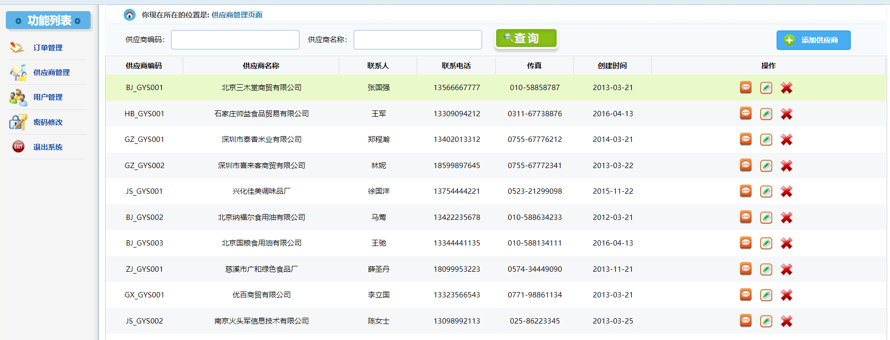

### 4.项目部署

- SMBMS编译后的项目：下载地址

    - 编译后的项目：即在IDEA中运行成功后，生成的out文件夹下"`out\artifacts\Test_war_exploded`"文件夹；

  

  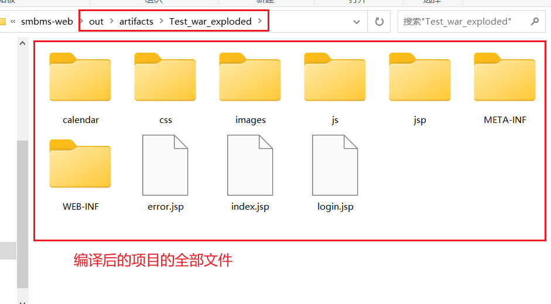

- 具体部署运行：

1. 修改端口号(==可略==)；

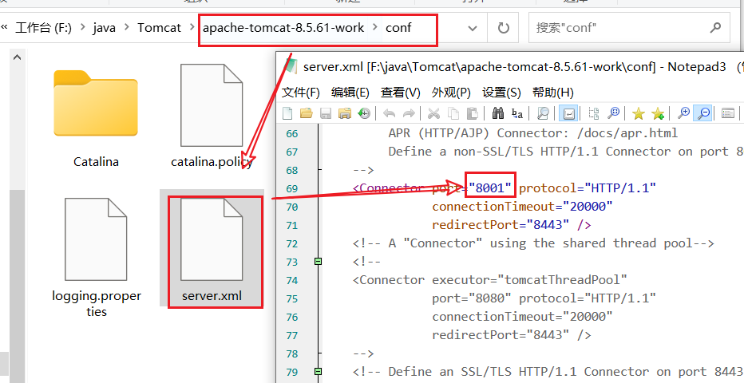

2. 将编译后的项目文件放入`Tomcat的webapps目录`下：


3. 修改项目密码及用户名；

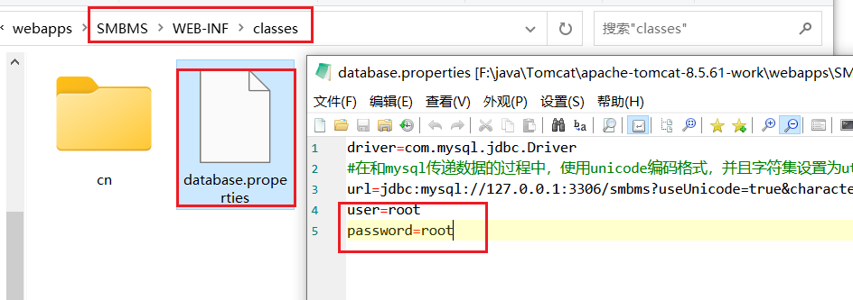

4. 启动服务器，运行项目；

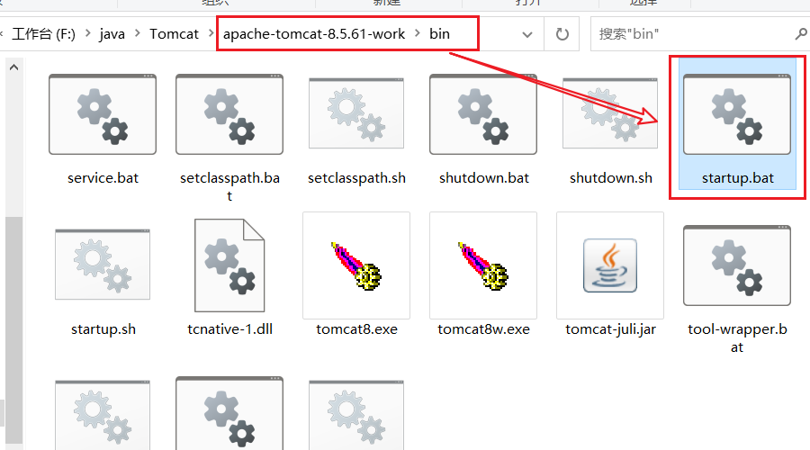

5. 在浏览器输入路径，查看项目；

```java
格式：
    http://localhost:端口号/webapps目录下项目文件夹名(注意大小写)/
个人路径：    
    http://localhost:8001/SMBMS/
```

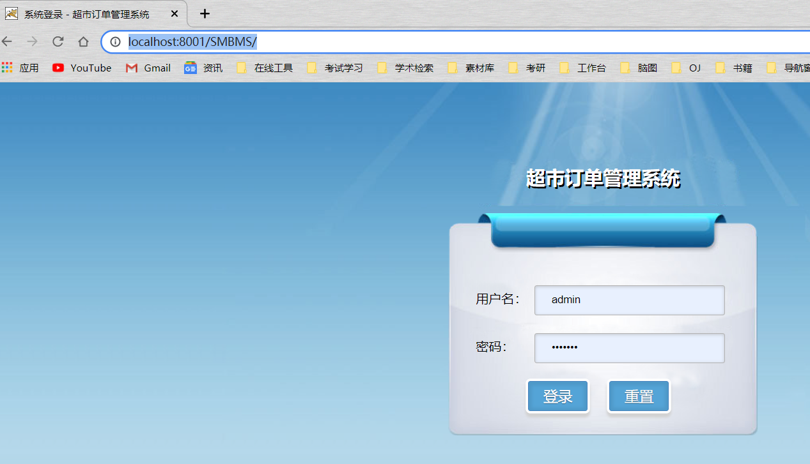


## 🎉🎉全剧终🎉🎉

